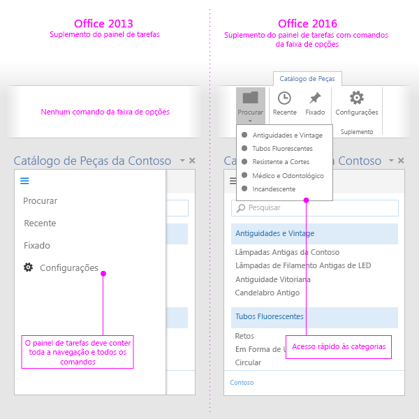

# Comandos de suplemento para Excel, Word e PowerPoint

Comandos de suplemento s?o elementos de interface do usu?rio que estendem a interface do usu?rio do Office e iniciam a??es no suplemento. Voc? pode usar comandos de suplemento para adicionar um bot?o ? faixa de op??es ou um item a um menu de contexto. Ao selecionar um comando de suplemento, os usu?rios iniciam a??es como executar c?digo JavaScript ou exibir uma p?gina do suplemento em um painel de tarefas. Os comandos de suplemento ajudam os usu?rios a localizar e usar o suplemento, o que pode ajud?-lo a aumentar a ado??o e a reutiliza??o do suplemento, al?m de melhorar a reten??o de clientes.

Para uma vis?o geral do recurso, confira o v?deo [Comandos de Suplemento na Faixa de Op??es do Office](https://channel9.msdn.com/events/Build/2016/P551).

> [!NOTE]
> Os cat?logos do SharePoint n?o s?o compat?veis com os comandos de suplemento. ? poss?vel implantar comandos de suplemento pela [Implanta??o centralizada](../publish/centralized-deployment.md) ou pelo [AppSource](https://docs.microsoft.com/en-us/office/dev/store/submit-to-the-office-store) ou usar [sideload](../testing/create-a-network-shared-folder-catalog-for-task-pane-and-content-add-ins.md) para implantar seu comando de suplemento para testes. 

*Figura 1. Suplemento com comandos em execu??o na ?rea de Trabalho do Excel*

*Figura 2. Suplemento com comandos em execu??o no Excel Online*

## Recursos de comandos
Os seguintes recursos de comando s?o compat?veis no momento.

> [!NOTE]
> Atualmente os suplementos de conte?do n?o d?o suporte a comandos de suplemento.

**Pontos de extens?o**

- Guias da faixa de op??es: estender as guias internas ou criar uma nova guia personalizada.
- Menus de contexto: estender os menus de contexto selecionados. 

**Tipos de controle**

- Bot?es simples: disparar a??es espec?ficas.
- Menus ? menu suspenso simples com bot?es que disparam a??es.

**A??es**

- ShowTaskpane: exibe um ou v?rios pain?is que carregam p?ginas HTML personalizadas dentro deles.
- ExecuteFunction: carrega uma p?gina HTML invis?vel e executa uma fun??o JavaScript dentro dela. Para mostrar a interface do usu?rio dentro de sua fun??o (como erros, progresso ou entrada adicional), voc? pode usar a API [displayDialog](http://dev.office.com/reference/add-ins/shared/officeui).  

## Plataformas com suporte
Os comandos de suplemento atualmente t?m suporte nas seguintes plataformas:

- Office para ?rea de Trabalho do Windows 2016 (compila??o 16.0.6769+)
- Office para Mac (compila??o 15.33+)
- Office Online 

Mais plataformas ser?o inclu?das em breve.

## Pr?ticas recomendadas

Aplique as seguintes pr?ticas recomendadas ao desenvolver comandos de suplementos:

- Use os comandos para representar uma a??o espec?fica com um resultado claro e espec?fico para os usu?rios. N?o combine v?rias a??es em um ?nico bot?o.
- Forne?a a??es granulares que tornam a realiza??o de tarefas comuns no seu suplemento mais eficiente. Minimize o n?mero de etapas necess?rias para concluir uma tarefa.
- Para o posicionamento dos comandos na faixa de op??es do Office:
    - Insira os comandos em uma guia existente (Inserir, Revisar e assim por diante) se a funcionalidade fornecida se encaixar ali. Por exemplo, se seu suplemento permitir que os usu?rios insiram m?dia, adicione um grupo ? guia Inserir. Observe que nem todas as guias est?o dispon?veis em todas as vers?es do Office. Para saber mais, confira o [Manifesto XML dos Suplementos do Office](../develop/add-in-manifests.md). 
    - Insira comandos na guia P?gina Inicial se a funcionalidade n?o se encaixar em outra guia e voc? menos de seis comandos de n?vel superior. Voc? tamb?m pode adicionar comandos ? guia P?gina Inicial se seu suplemento precisar funcionar em diferentes vers?es do Office (como o Office para ?rea de trabalho e o Office Online) e uma guia n?o estiver dispon?vel em todas as vers?es (por exemplo, a guia Design n?o existe no Office Online).  
    - Coloque os comandos em uma guia personalizada se voc? tiver mais de seis comandos de n?vel superior. 
    - Nomeie seu grupo de acordo com o nome do seu suplemento. Se voc? tiver v?rios grupos, nomeie cada grupo com base na funcionalidade que os comandos nesse grupo fornecem.
    - N?o adicione bot?es sup?rfluos para aumentar o estado real do seu suplemento.

     > [!NOTE]
     > Os suplementos que ocupam muito espa?o podem n?o passar na [Valida??o do AppSource](https://docs.microsoft.com/en-us/office/dev/store/validation-policies).

- Para todos os ?cones, siga as [diretrizes de design de ?cones](design-icons.md).
- Forne?a uma vers?o do seu suplemento que tamb?m funcione em hosts que n?o tenham suporte para comandos. Um manifesto de suplemento ?nico poder? funcionar tanto em hosts cientes do comando (com os comandos) quanto em hosts n?o cientes do comando (como um painel de tarefas).

   *Figura 3. Suplemento de painel de tarefas no Office 2013 e o mesmo suplemento usando comandos de suplementos no Office 2016*

   

## Pr?ximas etapas

A melhor maneira de come?ar a usar os comandos de suplemento ? conferir os [exemplos de comandos de Suplemento do Office](https://github.com/OfficeDev/Office-Add-in-Commands-Samples/) no GitHub.

Saiba mais sobre como especificar comandos de suplemento no manifesto em [Criar comandos de suplemento no manifesto](../develop/create-addin-commands.md) e no conte?do de refer?ncia [VersionOverrides](https://dev.office.com/reference/add-ins/manifest/versionoverrides).

