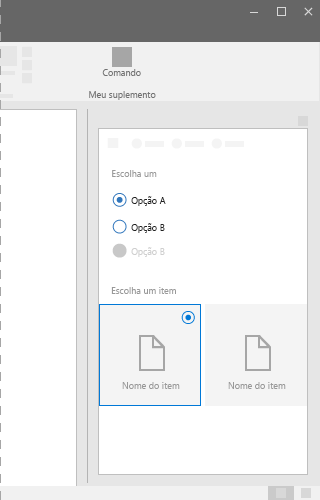
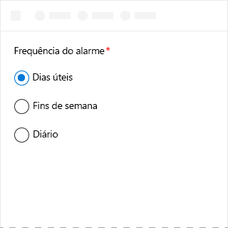

# Componente ChoiceGroup no Office UI Fabric

O componente ChoiceGroup, tamb?m conhecido como um bot?o de op??o, apresenta aos usu?rios duas ou mais op??es mutuamente exclusivas. Os usu?rios podem selecionar apenas um bot?o do ChoiceGroup em um grupo. Cada op??o ? representada por um bot?o do ChoiceGroup. 
  
#### Exemplo: ChoiceGroup em um painel de tarefas

 

## Pr?ticas recomendadas

|**Fa?a**|**N?o fa?a**|
|:------------|:--------------|
|Mantenha as op??es de ChoiceGroup no mesmo n?vel.   |N?o utilize ChoiceGroups ou caixas de sele??o aninhados.   |
|Use ChoiceGroups com duas a sete op??es, verificando se h? espa?o suficiente na tela para mostrar todas as op??es. Caso contr?rio, use uma caixa de sele??o ou lista suspensa.|N?o use quando as op??es forem n?meros com uma grada??o fixa, por exemplo, 10, 20, 30 e assim por diante. Em vez disso, use um componente de controle deslizante.|
|Se os usu?rios n?o puderem escolher nenhuma das op??es, considere incluir uma op??o como **Nenhum** ou **N?o se aplica**.|N?o use dois bot?es de ChoiceGroup para uma ?nica op??o bin?ria.|
|Se poss?vel, alinhe os bot?es de ChoiceGroup verticalmente em vez de horizontalmente. O alinhamento horizontal ? mais dif?cil de ler e localizar.||
|Liste as op??es em ordem l?gica, por exemplo, da op??o mais prov?vel a ser selecionada at? a menos, da opera??o mais simples at? a mais complexa ou do menor risco para o maior risco. |N?o use ordena??o alfab?tica porque ? dependente do idioma.|

## Variantes

|**Varia??o**|**Descri??o**|**Exemplo**|
|:------------|:--------------|:----------|
|**ChoiceGroups**|Use quando n?o forem necess?rias imagens para fazer uma escolha.| |
|**ChoiceGroups usando imagens**|Use quando forem necess?rias imagens para fazer uma escolha.| |

## Implementa??o

Para saber mais, confira [ChoiceGroup](https://dev.office.com/fabric#/components/choicegroup) e [Primeiros passos com exemplo de c?digo do Fabric React](https://github.com/OfficeDev/Word-Add-in-GettingStartedFabricReact).

## Veja tamb?m

- [Padr?es de design da experi?ncia do usu?rio](https://github.com/OfficeDev/Office-Add-in-UX-Design-Patterns-Code)
- [Office UI Fabric em Suplementos do Office](office-ui-fabric.md)
