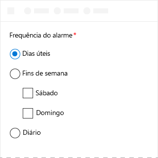

# Componente ChoiceGroup no Office UI FabricChoiceGroup component in Office UI Fabric

O componente ChoiceGroup, também conhecido como um botão de opção, apresenta aos usuários duas ou mais opções mutuamente exclusivas. Os usuários podem selecionar apenas um botão do ChoiceGroup em um grupo. Cada opção é representada por um botão do ChoiceGroup.The ChoiceGroup component, also known as a radio button, presents users with two or more mutually exclusive options. Users can select only one ChoiceGroup button in a group. Each option is represented by one ChoiceGroup button. 
  
#### Exemplo: ChoiceGroup em um painel de tarefasExample: ChoiceGroup in a task pane

 

## Práticas recomendadasBest practices

|**Faça****Do**|**Não faça****Don't**|
|:------------|:--------------|
|Mantenha as opções de ChoiceGroup no mesmo nível.Keep ChoiceGroup options at the same level.   |Não utilize ChoiceGroups ou caixas de seleção aninhados.Don't use nested ChoiceGroups or check boxes.   |
|Use ChoiceGroups com duas a sete opções, verificando se há espaço suficiente na tela para mostrar todas as opções.Use ChoiceGroups with 2-7 options, ensuring there is enough screen space to show all options. Caso contrário, use uma caixa de seleção ou lista suspensa.Otherwise, use a check box or drop-down list.|Não use quando as opções forem números com uma gradação fixa, por exemplo, 10, 20, 30 e assim por diante. Em vez disso, use um componente de controle deslizante.Don't use when the options are numbers with a fixed step, for example 10, 20, 30, and so on. Instead, use a slider component.|
|Se os usuários não puderem escolher nenhuma das opções, considere incluir uma opção como **Nenhum** ou **Não se aplica**.If users may not choose any of the options, consider including an option such as **None** or **Does not apply**.|Não use dois botões de ChoiceGroup para uma única opção binária.Don’t use two ChoiceGroup buttons for a single binary choice.|
|Se possível, alinhe os botões de ChoiceGroup verticalmente em vez de horizontalmente. O alinhamento horizontal é mais difícil de ler e localizar.If possible, align ChoiceGroup buttons vertically instead of horizontally. Horizontal alignment is harder to read and localize.||
|Liste as opções em ordem lógica, por exemplo, da opção mais provável a ser selecionada até a menos, da operação mais simples até a mais complexa ou do menor risco para o maior risco.List options in logical order, for example, the most likely option to be selected to the least, the simplest operation to the most complex, or the least risk to the highest risk. |Não use ordenação alfabética porque é dependente do idioma.Don't use alphabetical ordering because it is language dependent.|

## VariantesVariants

|**Variação****Variation**|**Descrição****Description**|**Exemplo****Example**|
|:------------|:--------------|:----------|
|**ChoiceGroups****ChoiceGroups**|Use quando não forem necessárias imagens para fazer uma escolha.Use when imagery is not necessary for making a selection.| |
|**ChoiceGroups usando imagens****ChoiceGroups using images**|Use quando forem necessárias imagens para fazer uma escolha.Use when imagery is necessary for making a selection.| |

## ImplementaçãoImplementation

Para saber mais, confira [ChoiceGroup](https://dev.office.com/fabric#/components/choicegroup) e [Primeiros passos com exemplo de código do Fabric React](https://github.com/OfficeDev/Word-Add-in-GettingStartedFabricReact).For details, see [ChoiceGroup](https://dev.office.com/fabric#/components/choicegroup) and [Getting started with Fabric React code sample](https://github.com/OfficeDev/Word-Add-in-GettingStartedFabricReact).

## Veja tambémSee also

- [Padrões de design da experiência do usuárioUX Design Patterns](https://github.com/OfficeDev/Office-Add-in-UX-Design-Patterns-Code)
- [Office UI Fabric em Suplementos do OfficeOffice UI Fabric in Office Add-ins](office-ui-fabric.md)
