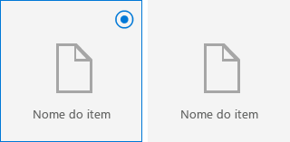

# Componente ChoiceGroup no Office UI FabricChoiceGroup component in Office UI Fabric

O componente ChoiceGroup, tamb?m conhecido como um bot?o de op??o, apresenta aos usu?rios duas ou mais op??es mutuamente exclusivas. Os usu?rios podem selecionar apenas um bot?o do ChoiceGroup em um grupo. Cada op??o ? representada por um bot?o do ChoiceGroup.The ChoiceGroup component, also known as a radio button, presents users with two or more mutually exclusive options. Users can select only one ChoiceGroup button in a group. Each option is represented by one ChoiceGroup button. 
  
#### Exemplo: ChoiceGroup em um painel de tarefasExample: ChoiceGroup in a task pane

 

## Pr?ticas recomendadasBest practices

|**Fa?a****Do**|**N?o fa?a****Don't**|
|:------------|:--------------|
|Mantenha as op??es de ChoiceGroup no mesmo n?vel.Keep ChoiceGroup options at the same level.   |N?o utilize ChoiceGroups ou caixas de sele??o aninhados.Don't use nested ChoiceGroups or check boxes.   |
|Use ChoiceGroups com duas a sete op??es, verificando se h? espa?o suficiente na tela para mostrar todas as op??es.Use ChoiceGroups with 2-7 options, ensuring there is enough screen space to show all options. Caso contr?rio, use uma caixa de sele??o ou lista suspensa.Otherwise, use a check box or drop-down list.|N?o use quando as op??es forem n?meros com uma grada??o fixa, por exemplo, 10, 20, 30 e assim por diante. Em vez disso, use um componente de controle deslizante.Don't use when the options are numbers with a fixed step, for example 10, 20, 30, and so on. Instead, use a slider component.|
|Se os usu?rios n?o puderem escolher nenhuma das op??es, considere incluir uma op??o como **Nenhum** ou **N?o se aplica**.If users may not choose any of the options, consider including an option such as **None** or **Does not apply**.|N?o use dois bot?es de ChoiceGroup para uma ?nica op??o bin?ria.Don?t use two ChoiceGroup buttons for a single binary choice.|
|Se poss?vel, alinhe os bot?es de ChoiceGroup verticalmente em vez de horizontalmente. O alinhamento horizontal ? mais dif?cil de ler e localizar.If possible, align ChoiceGroup buttons vertically instead of horizontally. Horizontal alignment is harder to read and localize.||
|Liste as op??es em ordem l?gica, por exemplo, da op??o mais prov?vel a ser selecionada at? a menos, da opera??o mais simples at? a mais complexa ou do menor risco para o maior risco.List options in logical order, for example, the most likely option to be selected to the least, the simplest operation to the most complex, or the least risk to the highest risk. |N?o use ordena??o alfab?tica porque ? dependente do idioma.Don't use alphabetical ordering because it is language dependent.|

## VariantesVariants

|**Varia??o****Variation**|**Descri??o****Description**|**Exemplo****Example**|
|:------------|:--------------|:----------|
|**ChoiceGroups****ChoiceGroups**|Use quando n?o forem necess?rias imagens para fazer uma escolha.Use when imagery is not necessary for making a selection.| |
|**ChoiceGroups usando imagens****ChoiceGroups using images**|Use quando forem necess?rias imagens para fazer uma escolha.Use when imagery is necessary for making a selection.| |

## Implementa??oImplementation

Para saber mais, confira [ChoiceGroup](https://dev.office.com/fabric#/components/choicegroup) e [Primeiros passos com exemplo de c?digo do Fabric React](https://github.com/OfficeDev/Word-Add-in-GettingStartedFabricReact).For details, see [ChoiceGroup](https://dev.office.com/fabric#/components/choicegroup) and [Getting started with Fabric React code sample](https://github.com/OfficeDev/Word-Add-in-GettingStartedFabricReact).

## Veja tamb?mSee also

- [Padr?es de design da experi?ncia do usu?rioUX Design Patterns](https://github.com/OfficeDev/Office-Add-in-UX-Design-Patterns-Code)
- [Office UI Fabric em Suplementos do OfficeOffice UI Fabric in Office Add-ins](office-ui-fabric.md)
