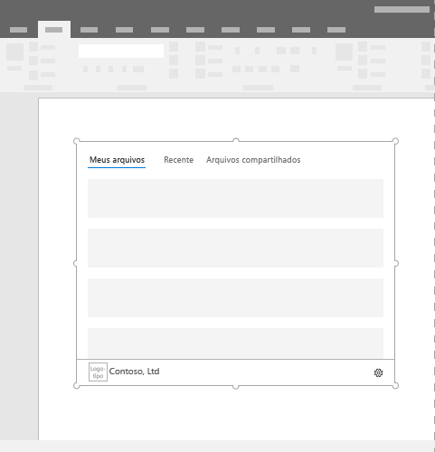

# Suplementos de conte?do do Office

Suplementos de conte?do s?o superf?cies que podem ser incorporadas diretamente em documentos do Word, Excel ou PowerPoint. Os suplementos de conte?do concedem aos usu?rios acesso a controles de interface que executam c?digos para modificar documentos ou exibir dados de uma fonte de dados. Use suplementos de conte?do quando quiser inserir a funcionalidade diretamente no documento.  

*Figura 1. Layout t?pico dos suplementos de conte?do*

## Pr?ticas recomendadas

- Inclua alguns elementos de navega??o ou comando, como CommandBar ou Pivot, na parte superior do suplemento.
- Inclua um elemento da marca, como BrandBar, na parte inferior do suplemento (aplica-se apenas a suplementos do Word, Excel e PowerPoint).

## Variantes

Os tamanhos dos suplementos de conte?do para Word, Excel e PowerPoint na ?rea de trabalho do Office 2016 e do Office 365 s?o especificados pelo usu?rio.

## Menu de personalidade

Menus de personalidade podem obstruir elementos de navega??o e comando localizados perto da parte superior direita do suplemento. Veja a seguir as dimens?es atuais do menu personalidade no Windows e Mac.

No Windows, o menu de personalidade mede 12 x 32 pixels, conforme mostrado.

*Figura 2. Menu de personalidade no Windows* 

No Mac, o menu de personalidade mede 26 x 26 pixels, mas flutua 8 pixels a partir da direita e 6 pixels a partir do topo, o que aumenta o espa?o ocupado para 34 x 32 pixels, como mostrado.

*Figura 3. Menu de personalidade no Mac*

## Implementa??o

Para ver um exemplo que implementa um suplemento de conte?do, confira [Suplemento de conte?do do Excel Humongous Insurance](https://github.com/OfficeDev/Excel-Content-Add-in-Humongous-Insurance) no GitHub.

## Considera??es sobre o suporte
- Verifique se os suplementos do Office funcionar?o em uma [plataforma de host do Office espec?fica](https://docs.microsoft.com/en-us/office/dev/add-ins/overview/office-add-in-availability). 
- Alguns suplementos de conte?do podem obrigar o usu?rio a "confiar" neles para ler e gravar no Excel ou no PowerPoint. Voc? pode declarar no manifesto do suplemento quais [n?veis de permiss?o](https://docs.microsoft.com/en-us/office/dev/add-ins/develop/requesting-permissions-for-api-use-in-content-and-task-pane-add-ins) deseja que o usu?rio tenha.  
- Os suplementos de conte?do s?o compat?veis com o Excel e o PowerPoint nas vers?es do Office 2013 e posteriores. Se voc? abrir um suplemento em uma vers?o do Office n?o compat?vel com os suplementos web do Office, eles aparecer?o como imagem.

## Confira tamb?m
- [Disponibilidade de host e plataforma para suplementos do Office](https://docs.microsoft.com/en-us/office/dev/add-ins/overview/office-add-in-availability)
- [Office UI Fabric em Suplementos do Office](https://docs.microsoft.com/en-us/office/dev/add-ins/design/office-ui-fabric) 
- [Padr?es de design da experi?ncia do usu?rio para suplementos do Office](https://docs.microsoft.com/en-us/office/dev/add-ins/design/ux-design-patterns)
- [Solicitar permiss?es para uso da API em suplementos do painel de tarefas e conte?do](https://docs.microsoft.com/en-us/office/dev/add-ins/develop/requesting-permissions-for-api-use-in-content-and-task-pane-add-ins)
