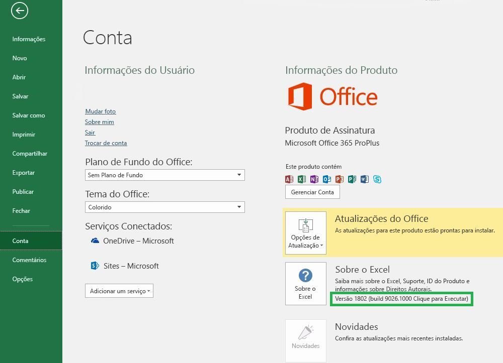

# Versões do Office e conjuntos de requisitos

Há várias versões do Office em várias plataformas, e nem todas dão suporte a cada API na API JavaScript para Office (Office.js). Nem sempre você terá controle sobre a versão do Office que os usuários instalaram.  Para lidar com essa situação, fornecemos um sistema chamado de conjuntos de requisitos para ajudar você a determinar se um host do Office dá suporte para com os recursos necessários em seu Suplemento do Office. 

> [!NOTE]
> - O Office é executado em várias plataformas, incluindo o Office para Windows, o Office Online, o Office para Mac e o Office para iPad.  
> - Entre os exemplos de hosts do Office estão os produtos do Office: Excel, Word, PowerPoint, Outlook, OneNote e assim por diante.  
> - Um conjunto de requisito é um grupo nomeado de membros da API, por exemplo, `ExcelApi 1.5`, `WordApi 1.3` etc.  

## Como verificar sua versão do Office

Para identificar a versão do Office que você está usando, em um aplicativo do Office, selecione o menu **Arquivo** e escolha **Conta**. A versão do Office aparecerá na seção **Informações do Produto**. Por exemplo, a captura de tela a seguir indica o Office Versão 1802 (Build 9026.1000):

## Disponibilidade dos conjuntos de requisitos do Office

Os Suplementos do Office podem usar conjuntos de requisitos de API para determinar se o host do Office oferece suporte aos membros da API necessários. O suporte a um conjunto de requisitos varia de acordo com o host do Office e a versão do host do Office (veja a seção anterior).

Alguns hosts do Office tem seus próprios conjuntos de requisitos de API. Por exemplo, o primeiro conjunto de requisitos para a API do Excel foi `ExcelApi 1.1`, e o primeiro conjunto de requisitos para a API do Word foi `WordApi 1.1`. Desde então, vários conjuntos de requisitos novos de ExcelApi e WordApi foram adicionados para fornecer mais funcionalidades de API.

Além disso, outras funcionalidades como comandos de suplemento (extensibilidade da faixa de opções) e a capacidade de iniciar caixas de diálogo (API de Diálogo) foram adicionadas a API comum. Os comandos de suplemento e os conjuntos de requisitos de API de Diálogo são exemplos de conjuntos de API que os diversos hosts do Office compartilham em comum.

Um suplemento só pode usar APIs em conjuntos de requisitos compatíveis com a versão do host do Office na qual ele está em execução. Para saber exatamente quais conjuntos de requisitos estão disponíveis para uma versão específica de host do Office, confira os seguintes artigos sobre conjunto de requisitos específicos ao host:

- [Conjuntos de requisitos de API JavaScript para Excel](https://docs.microsoft.com/javascript/office/requirement-sets/excel-api-requirement-sets?view=office-js) (ExcelApi)
- [Conjuntos de requisitos de API JavaScript para Word](https://docs.microsoft.com/javascript/office/requirement-sets/word-api-requirement-sets?view=office-js) (WordApi)
- [Conjuntos de requisitos de API JavaScript para OneNote](https://docs.microsoft.com/javascript/office/requirement-sets/onenote-api-requirement-sets?view=office-js) (OneNoteApi)
- [Noções básicas sobre conjuntos de requisitos da API do Outlook](https://docs.microsoft.com/javascript/office/requirement-sets/outlook-api-requirement-sets?view=office-js) (MailBox)

Alguns conjuntos de requisito contêm APIs que podem ser usadas por qualquer host do Office. Para saber mais sobre esses conjuntos de requisitos, confira estes artigos:

- [Conjuntos de requisitos comuns do Office](https://docs.microsoft.com/javascript/office/requirement-sets/office-add-in-requirement-sets?view=office-js)
- [Conjuntos de requisitos dos comandos de suplemento](https://docs.microsoft.com/javascript/office/requirement-sets/add-in-commands-requirement-sets?view=office-js)
- [Conjuntos de requisitos da API de Caixa de Diálogo](https://docs.microsoft.com/javascript/office/requirement-sets/dialog-api-requirement-sets?view=office-js)
- [Conjuntos de requisitos da API de Identidade](https://docs.microsoft.com/javascript/office/requirement-sets/identity-api-requirement-sets?view=office-js)

O número da versão de um conjunto de requisitos, como "1.1" no `ExcelApi 1.1`, tem relação com o host do Office. O número da versão de um certo conjunto de requisitos (por exemplo, `ExcelApi 1.1`), não corresponde ao número da versão do Office.js ou aos conjuntos de requisitos para outros hosts do Office (por exemplo, Word, Outlook etc.).  Lançamos os conjuntos de requisitos para diferentes hosts do Office em ritmos e períodos diferentes. Por exemplo, `ExcelApi 1.5` foi lançado antes do conjunto de requisitos `WordApi 1.3`.

A biblioteca da API JavaScript para Office (Office.js) inclui todos os conjuntos de requisitos disponíveis no momento. Embora exista algo como conjuntos de requisitos `ExcelApi 1.3` e `WordApi 1.3`, há nenhum conjunto de requisitos `Office.js 1.3`. A versão mais recente do Office.js é mantida como um único ponto de extremidade do Office fornecida por meio da rede de distribuição de conteúdo (CDN). Saiba mais sobre a CDN do Office.js, inclusive como é feito o controle de versão e como lidar com a compatibilidade com versões anteriores, em [Noções básicas da API JavaScript para Office](https://docs.microsoft.com/office/dev/add-ins/develop/understanding-the-javascript-api-for-office).

## Especificar hosts do Office e conjuntos de requisitos

Há várias maneiras de especificar quais hosts do Office e conjuntos de requisitos são exigidos por um suplemento.  Para saber mais detalhes, confira [Especificar requisitos de API e hosts do Office](https://docs.microsoft.com/office/dev/add-ins/develop/specify-office-hosts-and-api-requirements).

## Veja também

- [Especificar requisitos da API e de hosts do Office](https://docs.microsoft.com/office/dev/add-ins/develop/specify-office-hosts-and-api-requirements)
- [Instalar a última versão do Office](https://docs.microsoft.com/office/dev/add-ins/develop/install-latest-office-version)
- [Visão geral dos canais de atualização do Office 365 ProPlus](https://docs.microsoft.com/deployoffice/overview-of-update-channels-for-office-365-proplus)
- [Tirar o máximo proveito do Office com o Office 365](https://products.office.com/compare-all-microsoft-office-products?tab=2)
