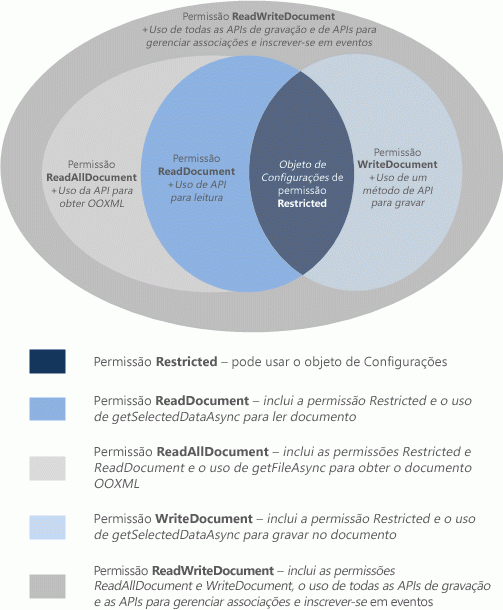

# <a name="requesting-permissions-for-api-use-in-content-and-task-pane-add-ins"></a>Solicitar permissões para uso da API em suplementos do painel de tarefas e conteúdo

Este artigo descreve os diferentes níveis de permissão que você pode declarar no manifesto do suplemento de conteúdo ou de painel de tarefas para especificar o nível de acesso à API JavaScript que o suplemento requer para seus recursos. 


## <a name="permissions-model"></a>Modelo de permissões


Um modelo de permissões de acesso da API JavaScript de cinco níveis fornece a base para a privacidade e a segurança para os usuários dos seus complementos de conteúdo e de painel de tarefas. A Figura 1 mostra os cinco níveis de permissões de API que você pode declarar no manifesto do seu suplemento.


*Figura 1. Modelo de permissão de cinco níveis para suplementos de conteúdo e de painel de  tarefas*




Essas permissões especificam o subconjunto da API que o tempo de execução do suplemento permitirá que o suplemento de conteúdo ou de painel de tarefas use quando um usuário inserir e ativar o suplemento (confiar nele). Para declarar o nível de permissão que o suplemento do conteúdo ou do painel de tarefas requer, especifique um dos valores de texto da permissão no elemento [Permissions](https://docs.microsoft.com/office/dev/add-ins/reference/manifest/permissions?view=office-js) do manifesto do suplemento. O exemplo a seguir solicita a permissão  **WriteDocument**, que autorizará somente os métodos que podem gravar no documento, mas não lê-lo.


```XML
<Permissions>WriteDocument</Permissions>
```

Como prática recomendada, você deve solicitar permissões com base no princípio do _menor privilégio_. Ou seja, você deve solicitar permissão para acessar apenas o subconjunto mínimo da API que o suplemento requer para funcionar corretamente. Por exemplo, se o suplemento precisar apenas ler os dados no documento de um usuário para seus recursos, você não deve solicitar mais do que a permissão **ReadDocument**.

A tabela a seguir descreve o subconjunto da API JavaScript que é habilitado por cada nível de permissão.


|**Permissão**|**Subconjunto habilitado da API**|
|:-----|:-----|
|**Restrito**|Os métodos do objeto [Settings](https://docs.microsoft.com/javascript/api/office/office.settings?view=office-js) e o método [Document.getActiveViewAsync](https://docs.microsoft.com/javascript/api/office/office.document?view=office-js#getactiveviewasync-options--callback-). Esse é o nível mínimo de permissão que pode ser solicitado por um suplemento de conteúdo ou de painel de tarefas.|
|**ReadDocument**|Além da API autorizada pela permissão **Restricted**, adiciona acesso aos membros da API necessários para ler o documento e gerenciar associações. Isso inclui o uso de:<br/><ul><li>O método <a href="https://docs.microsoft.com/javascript/api/office/office.document?view=office-js#getselecteddataasync-coerciontype--options--callback-" target="_blank">Document.getSelectedDataAsync</a> para obter o texto selecionado, HTML (Word apenas) ou dados tabulares, mas não o código do Open Office XML (OOXML) subjacente que contém todos os dados no documento.</p></li><li><p>O método <a href="https://docs.microsoft.com/javascript/api/office/office.document?view=office-js#getfileasync-filetype--options--callback-" target="_blank">Document.getFileAsync</a> para acessar todo o texto no documento, mas não a cópia binária OOXML subjacente do documento.</p></li><li><p>O método <a href="https://docs.microsoft.com/javascript/api/office/office.binding?view=office-js#getdataasync-options--callback-" target="_blank">Binding.getDataAsync</a> para a leitura dos dados vinculados no documento.</p></li><li><p>Os métodos <a href="https://docs.microsoft.com/javascript/api/office/office.bindings?view=office-js#addfromnameditemasync-itemname--bindingtype--options--callback-" target="_blank">addFromNamedItemAsync</a>, <a href="https://docs.microsoft.com/javascript/api/office/office.bindings?view=office-js#addfrompromptasync-bindingtype--options--callback-" target="_blank">addFromPromptAsync</a>e <a href="https://docs.microsoft.com/javascript/api/office/office.bindings?view=office-js#addfromselectionasync-bindingtype--options--callback-" target="_blank">addFromSelectionAsync</a> do objeto <span class="keyword">Bindings</span> para criar associações no documento.</p></li><li><p>Os métodos <a href="https://docs.microsoft.com/javascript/api/office/office.bindings?view=office-js#getallasync-options--callback-" target="_blank">getAllAsync</a>, <a href="https://docs.microsoft.com/javascript/api/office/office.bindings?view=office-js#getbyidasync-id--options--callback-" target="_blank">getByIdAsync</a> e <a href="https://docs.microsoft.com/javascript/api/office/office.bindings?view=office-js#releasebyidasync-id--options--callback-" target="_blank">releaseByIdAsync</a> do objeto <span class="keyword">Bindings</span> para acessar e remover as associações no documento.</p></li><li><p>O método <a href="https://docs.microsoft.com/javascript/api/office/office.document?view=office-js#getfilepropertiesasync-options--callback-" target="_blank">Document.getFilePropertiesAsync</a> para acessar as propriedades de arquivo do documento, como a URL do documento.</p></li><li><p>O método <a href="https://docs.microsoft.com/javascript/api/office/office.document?view=office-js#gotobyidasync-id--gototype--options--callback-" target="_blank">Document.goToByIdAsync</a> para navegar até os objetos nomeados e locais no documento.</p></li><li><p>Para os suplementos do painel de tarefas do Project, todos os métodos "get" do objeto <a href="https://docs.microsoft.com/javascript/api/office/office.document?view=office-js" target="_blank">ProjectDocument</a>. </p></li></ul>|
|**ReadAllDocument**|Além da API autorizada pelas permissões **Restricted** e **ReadDocument**, permite os seguintes acessos adicionais aos dados do documento:<br/><ul><li><p>Os métodos <span class="keyword">Document.getSelectedDataAsync</span> e <span class="keyword">Document.getFileAsync</span> podem acessar o código OOXML subjacente do documento (que, além de texto, pode conter formatação, links, gráficos incorporados, comentários, revisões, etc.).</p></li></ul>|
|**WriteDocument**|Além da API autorizada pela permissão **Restricted**, adiciona acesso aos seguintes membros da API:<br/><ul><li><p>O método <a href="https://docs.microsoft.com/javascript/api/office/office.document?view=office-js#setselecteddataasync-data--options--callback-" target="_blank">Document.setSelectedDataAsync</a> para gravar na seleção do usuário no documento.</p></li></ul>|
|**ReadWriteDocument**|Além da API autorizada pelas permissões **Restricted**, **ReadDocument**, **ReadAllDocument** e **WriteDocument**, contém acesso a todas as APIs remanescentes compatíveis com suplementos de painel de tarefas e de conteúdo, incluindo métodos para se inscrever em eventos. Você precisa declarar a permissão **ReadWriteDocument** para acessar esses membros adicionais da API:<br/><ul><li><p>O método <a href="https://docs.microsoft.com/javascript/api/office/office.binding?view=office-js#setdataasync-data--options--callback-" target="_blank">Binding.setDataAsync</a> para gravar nas regiões associadas do documento.</p></li><li><p>O método <a href="https://docs.microsoft.com/javascript/api/office/office.tablebinding?view=office-js#addrowsasync-rows--options--callback-" target="_blank">TableBinding.addRowsAsync</a> para adicionar linhas às tabelas associadas.</p></li><li><p>O método <a href="https://docs.microsoft.com/javascript/api/office/office.tablebinding?view=office-js#addcolumnsasync-tabledata--options--callback-" target="_blank">TableBinding.addColumnsAsync</a> para adicionar colunas às tabelas associadas.</p></li><li><p>O método <a href="https://docs.microsoft.com/javascript/api/office/office.tablebinding?view=office-js#deletealldatavaluesasync-options--callback-" target="_blank">TableBinding.deleteAllDataValuesAsync</a> para excluir todos os dados em uma tabela associada.</p></li><li><p>Os métodos <a href="https://docs.microsoft.com/javascript/api/office/office.tablebinding?view=office-js#setformatsasync-cellformat--options--callback-" target="_blank">setFormatsAsync</a>, <a href="https://docs.microsoft.com/javascript/api/office/office.tablebinding?view=office-js#clearformatsasync-options--callback-" target="_blank">clearFormatsAsync</a> e <a href="https://docs.microsoft.com/javascript/api/office/office.tablebinding?view=office-js#settableoptionsasync-tableoptions--options--callback-" target="_blank">setTableOptionsAsync</a> do objeto <span class="keyword">TableBinding</span> para definir a formatação e as opções nas tabelas associadas.</p></li><li><p>Todos os membros dos objetos <a href="https://docs.microsoft.com/javascript/api/office/office.customxmlnode?view=office-js" target="_blank">CustomXmlNode</a>, <a href="https://docs.microsoft.com/javascript/api/office/office.customxmlpart?view=office-js" target="_blank">CustomXmlPart</a>, <a href="https://docs.microsoft.com/javascript/api/office/office.customxmlparts?view=office-js" target="_blank">CustomXmlParts</a> e <a href="https://docs.microsoft.com/javascript/api/office/office.customxmlprefixmappings?view=office-js" target="_blank">CustomXmlPrefixMappings</a>.</p></li><li><p>Todos os métodos para se inscrever em eventos compatíveis com suplementos de conteúdo e de painel de tarefas, especificamente os métodos <span class="keyword">addHandlerAsync</span> e <span class="keyword">removeHandlerAsync</span> dos objetos <a href="https://docs.microsoft.com/javascript/api/office/office.binding?view=office-js" target="_blank">Binding</a>, <a href="https://docs.microsoft.com/javascript/api/office/office.customxmlpart?view=office-js" target="_blank">CustomXmlPart</a>, <a href="https://docs.microsoft.com/javascript/api/office/office.document?view=office-js" target="_blank">Document</a>, <a href="https://docs.microsoft.com/javascript/api/office/office.document?view=office-js" target="_blank">ProjectDocument</a> e <a href="https://docs.microsoft.com/javascript/api/office/office.document?view=office-js#settings" target="_blank">Settings</a>.</p></li></ul>|

## <a name="see-also"></a>Confira também

- [Privacidade e segurança para suplementos do Office](../concepts/privacy-and-security.md)
    


