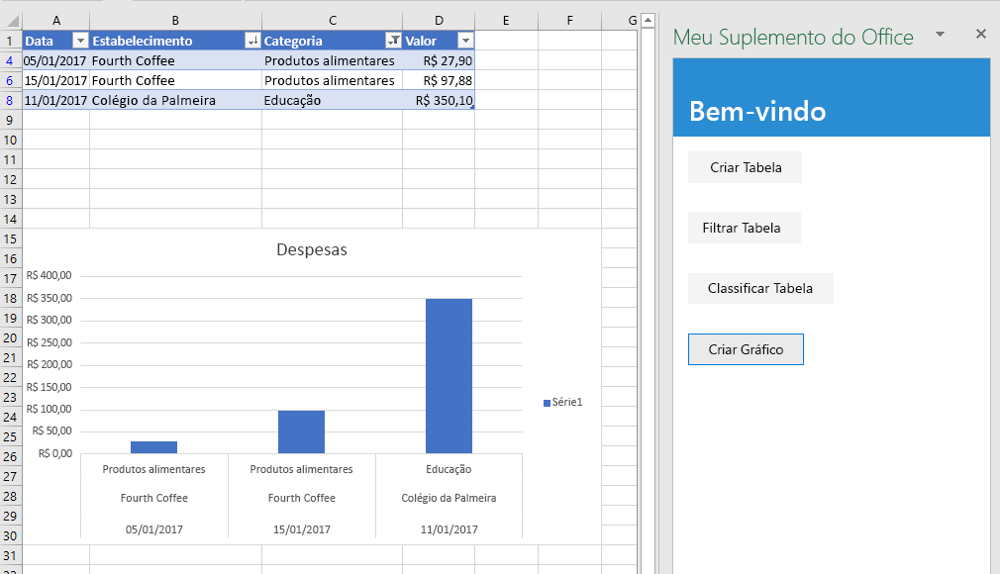

Nesta etapa do tutorial, você vai criar um gráfico com dados da tabela que você criou anteriormente e depois vai formatar o gráfico.

## <a name="chart-table-data"></a>Dados de tabela do gráfico

1. Abra o projeto em seu editor de código. 
2. Abra o arquivo index.html.
3. Abaixo do `div` que contém o botão `sort-table`, adicione a marcação a seguir:

    ```html
    <div class="padding">            
        <button class="ms-Button" id="create-chart">Create Chart</button>            
    </div>
    ```

4. Abra o arquivo app.js.

5. Abaixo da linha que atribui um identificador de clique ao botão `sort-chart`, adicione o seguinte código:

    ```js
    $('#create-chart').click(createChart);
    ```

6. Abaixo da função `sortTable`, adicione a função a seguir.

    ```js
    function createChart() {
        Excel.run(function (context) {
            
            // TODO1: Queue commands to get the range of data to be charted.

            // TODO2: Queue command to create the chart and define its type.

            // TODO3: Queue commands to position and format the chart.

            return context.sync();
        })
        .catch(function (error) {
            console.log("Error: " + error);
            if (error instanceof OfficeExtension.Error) {
                console.log("Debug info: " + JSON.stringify(error.debugInfo));
            }
        });
    }
    ``` 

7. Substitua `TODO1` pelo código a seguir. Para excluir a linha de cabeçalho, o código usa o método `Table.getDataBodyRange` para acessar o intervalo de dados que você deseja representar graficamente em vez do método `getRange`.

    ```js
    const currentWorksheet = context.workbook.worksheets.getActiveWorksheet();
    const expensesTable = currentWorksheet.tables.getItem('ExpensesTable');
    const dataRange = expensesTable.getDataBodyRange();
    ``` 

8. Substitua `TODO2` pelo código a seguir. Observe os seguintes parâmetros:
   - O primeiro parâmetro do método `add` especifica o tipo de gráfico. Existem vários tipos. 
   - O segundo parâmetro especifica um intervalo de dados a incluir no gráfico. 
   - O terceiro parâmetro determina se uma série de pontos de dados da tabela deve estar representada por linha ou por coluna. A opção `auto` informa ao Excel para decidir o melhor método.

    ```js
    let chart = currentWorksheet.charts.add('ColumnClustered', dataRange, 'auto');
    ``` 

9. Substitua `TODO3` pelo código a seguir. A maior parte do código é autoexplicativa. Observação:
   - Os parâmetros do método `setPosition` especificam as células da esquerda superior e da direita inferior da área da planilha que deve conter o gráfico. O Excel ajusta detalhes como a largura da linha para criar uma boa aparência para o gráfico no espaço fornecido.
   - "Série" é um conjunto de pontos de dados de uma coluna da tabela. Como há apenas uma coluna sem cadeia de caracteres na tabela, o Excel deduz que essa é a única coluna de pontos de dados no gráfico. Ele interpreta outras colunas como rótulos do gráfico. Portanto, haverá apenas uma série no gráfico e será necessário o índice 0. Ele será rotulado como "Valor em €". 

    ```js
    chart.setPosition("A15", "F30");
    chart.title.text = "Expenses";
    chart.legend.position = "right"
    chart.legend.format.fill.setSolidColor("white");
    chart.dataLabels.format.font.size = 15;
    chart.dataLabels.format.font.color = "black";
    chart.series.getItemAt(0).name = 'Value in €';
    ``` 

## <a name="test-the-add-in"></a>Testar o suplemento


1. Se a janela Git bash ou o prompt de sistema habilitado para Node.JS do tutorial anterior ainda estiverem abertos, digite Ctrl + C duas vezes para interromper a execução do servidor Web. Caso contrário, abra uma janela Git bash ou um prompt de sistema habilitado para Node.JS e navegue até a pasta **Iniciar** do projeto.

     > [!NOTE]
     > Embora o servidor de sincronização do navegador recarregue o suplemento no painel de tarefas sempre que você fizer uma alteração em algum arquivo, incluindo o arquivo app.js, ele não transcompila o JavaScript, portanto, é necessário repetir o comando de compilação para que as alterações em app.js as entrem em vigor. Para fazer isso, interrompa o processo do servidor para obter uma solicitação para inserir o comando de compilação. Após a compilação, reinicie o servidor. As próximas etapas executam esse processo.

1. Execute o comando `npm run build` para transcompilar seu código-fonte ES6 para uma versão anterior do JavaScript com suporte no Internet Explorer (que é usada em segundo plano pelo Excel para executar os suplementos do Excel).
2. Execute o comando `npm start` para iniciar um servidor Web em um host local.
4. Feche o painel de tarefas para recarregá-lo e, no menu **Início**, selecione **Mostrar Painel de Tarefas** para reabrir o suplemento.
5. Se, por algum motivo, a tabela estiver não na planilha aberta, no painel de tarefas, escolha **Criar tabela** e depois os botões **Filtrar tabela** e **Classificar tabela ** em qualquer ordem.
6. Clique no botão **Criar gráfico**. Um gráfico é criado e incluirá somente os dados das linhas que foram filtradas. Os rótulos dos pontos de dados na parte inferior estão na ordem de classificação do gráfico, ou seja, nomes de comerciantes em ordem alfabética inversa.

    
