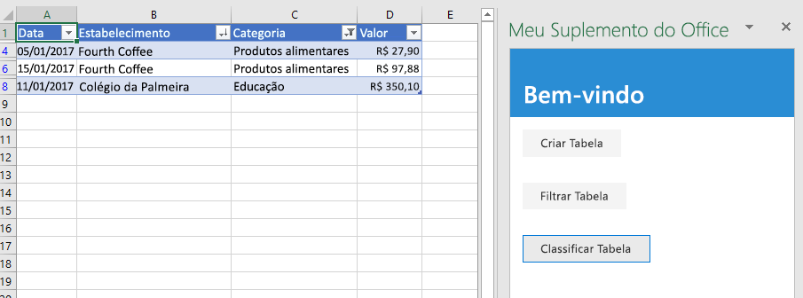

Nesta etapa do tutorial, você vai filtrar e classificar a tabela que criou anteriormente.

> [!NOTE]
> Esta página descreve uma etapa individual do tutorial de suplemento do Excel. Se você chegou aqui por meio dos resultados de mecanismos de pesquisa ou via outro link direto, acesse a página de Introdução do [tutorial de suplemento do Excel](../tutorials/excel-tutorial.yml) para começá-lo do início.

## <a name="filter-the-table"></a>Filtrar a tabela

1. Abra o projeto em seu editor de código. 
2. Abra o arquivo index.html.
3. Abaixo do `div`, que contém o botão `create-table`, adicione a marcação a seguir:

    ```html
    <div class="padding">            
        <button class="ms-Button" id="filter-table">Filter Table</button>            
    </div>
    ```

4. Abra o arquivo app.js.

5. Logo abaixo da linha que atribui um identificador de clique ao botão `create-table`, adicione o seguinte código:

    ```js
    $('#filter-table').click(filterTable);
    ```

6. Logo abaixo da função `createTable`, adicione a função a seguir:

    ```js
    function filterTable() {
        Excel.run(function (context) {
            
            // TODO1: Queue commands to filter out all expense categories except 
            //        Groceries and Education.

            return context.sync();
        })
        .catch(function (error) {
            console.log("Error: " + error);
            if (error instanceof OfficeExtension.Error) {
                console.log("Debug info: " + JSON.stringify(error.debugInfo));
            }
        });
    }
    ``` 

7. Substitua `TODO1` pelo código a seguir. Nota:
   - O código primeiro faz referência à coluna que precisa de filtragem ao passar o nome da coluna para o método `getItem`, em vez de passar o índice para o método `getItemAt` como o método `createTable` faz. Como os usuários podem mover as colunas da tabela, a coluna de um determinado índice pode mudar depois da criação da tabela. Portanto, é mais seguro usar o nome da coluna como referência dela. Usamos de forma segura `getItemAt` em um tutorial anterior porque usamos o mesmo método que cria a tabela. Assim não existe a chance de um usuário mover a coluna.
   - O método `applyValuesFilter` é um dos vários métodos de filtragem do objeto `Filter`.

    ```js
    const currentWorksheet = context.workbook.worksheets.getActiveWorksheet();
    const expensesTable = currentWorksheet.tables.getItem('ExpensesTable');
    const categoryFilter = expensesTable.columns.getItem('Category').filter;
    categoryFilter.applyValuesFilter(["Education", "Groceries"]);
    ``` 

## <a name="sort-the-table"></a>Classificar a tabela

1. Abra o arquivo index.html.
2. Abaixo do `div` que contém o botão `filter-table`, adicione a marcação a seguir:

    ```html
    <div class="padding">            
        <button class="ms-Button" id="sort-table">Sort Table</button>            
    </div>
    ```

3. Abra o arquivo app.js.

4. Abaixo da linha que atribui um identificador de clique ao botão `filter-table`, adicione o seguinte código:

    ```js
    $('#sort-table').click(sortTable);
    ```

5. Abaixo da função `filterTable`, adicione a função a seguir.

    ```js
    function sortTable() {
        Excel.run(function (context) {
            
            // TODO1: Queue commands to sort the table by Merchant name.

            return context.sync();
        })
        .catch(function (error) {
            console.log("Error: " + error);
            if (error instanceof OfficeExtension.Error) {
                console.log("Debug info: " + JSON.stringify(error.debugInfo));
            }
        });
    }
    ``` 

7. Substitua `TODO1` pelo código a seguir. Nota:
   - O código cria uma matriz de objetos `SortField` que tem apenas um membro, já que o suplemento só classifica a coluna Comerciante.
   - A propriedade `key` de um objeto `SortField` é o índice com base em zero da coluna a classificar.
   - O membro `sort` de uma `Table` é um objeto `TableSort`, não um método. Os `SortField`s são passados para o método `TableSort` do objeto `apply`.

    ```js
    const currentWorksheet = context.workbook.worksheets.getActiveWorksheet();
    const expensesTable = currentWorksheet.tables.getItem('ExpensesTable');
    const sortFields = [
        { 
            key: 1,            // Merchant column
            ascending: false,
        }
    ];

    expensesTable.sort.apply(sortFields);
    ``` 

## <a name="test-the-add-in"></a>Testar o suplemento

1. Se a janela Git bash ou o prompt de sistema habilitado para Node.JS do tutorial anterior ainda estiverem abertos, digite Ctrl + C duas vezes para interromper a execução do servidor Web. Caso contrário, abra uma janela Git bash ou um prompt de sistema habilitado para Node.JS e navegue até a pasta **Iniciar** do projeto.

     > [!NOTE]
     > Embora o servidor de sincronização do navegador recarregue o suplemento no painel de tarefas sempre que você fizer uma alteração em algum arquivo, incluindo o arquivo app.js, ele não transcompila o JavaScript, portanto, é necessário repetir o comando de compilação para que as alterações em app.js as entrem em vigor. Para fazer isso, interrompa o processo do servidor para obter uma solicitação para inserir o comando de compilação. Após a compilação, reinicie o servidor. As próximas etapas executam esse processo.

1. Execute o comando `npm run build` para transcompilar seu código-fonte ES6 para uma versão anterior do JavaScript com suporte no Internet Explorer (que é usada em segundo plano pelo Excel para executar os suplementos do Excel).
2. Execute o comando `npm start` para iniciar um servidor Web em um host local.
4. Feche o painel de tarefas para recarregá-lo e, no menu **Início**, selecione **Mostrar Painel de Tarefas** para reabrir o suplemento.
5. Se, por algum motivo, a tabela não estiver na planilha aberta, no painel de tarefas, escolha **Criar tabela**. 
6. Escolha os botões **Filtrar tabela** e **Classificar tabela** em qualquer ordem.

    
