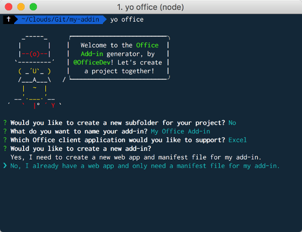

# <a name="build-an-excel-add-in-using-angular"></a>Criar um suplemento do Excel usando o Angular

Neste artigo, você passará pelo processo de criar um suplemento do Excel usando o Angular e a API JavaScript do Excel.

## <a name="prerequisites"></a>Pré-requisitos

- Verifique se você já tem os [pré-requisitos de CLI do Angular](https://github.com/angular/angular-cli#prerequisites) e instale todos os pré-requisitos ausentes.

- Instale globalmente a [CLI do Angular](https://github.com/angular/angular-cli). 

    ```bash
    npm install -g @angular/cli
    ```

- Instale a última versão do [Yeoman](https://github.com/yeoman/yo) e o [gerador do Yeoman para Suplementos do Office](https://github.com/OfficeDev/generator-office) globalmente.

    ```bash
    npm install -g yo generator-office
    ```

## <a name="generate-a-new-angular-app"></a>Gerar um novo aplicativo do Angular

Use a CLI do Angular para gerar seu aplicativo do Angular. No terminal, execute o seguinte comando:

```bash
ng new my-addin
```

## <a name="generate-the-manifest-file-and-sideload-the-add-in"></a>Gerar o arquivo de manifesto e fazer sideload do suplemento

Um arquivo de manifesto do suplemento define seus recursos e configurações.

1. Navegue até a pasta do seu aplicativo.

    ```bash
    cd my-addin
    ```

2. Use o gerador do Yeoman de modo a gerar o arquivo de manifesto para o suplemento. Execute o comando a seguir e responda aos prompts, conforme mostrado na captura de tela abaixo.

    ```bash
    yo office
    ```
    - **Would you like to create a new subfolder for your project?:** `No`
    - **What do you want to name your add-in?:** `My Office Add-in`
    - **Which Office client application would you like to support?:** `Excel`
    - **Would you like to create a new add-in?:** `No`

    O gerador perguntará se você deseja abrir **resource.html**. Não é necessário abri-lo para este tutorial, mas fique à vontade em fazer isso se tiver curiosidade. Escolha Sim ou Não para concluir o assistente e deixar o gerador fazer seu trabalho.

    
    
    > [!NOTE]
    > Se for solicitada a substituição de **package.json**, responda **Não** (não substituir).

3. Abra o arquivo de manifesto (isto é, o arquivo no diretório raiz do aplicativo com um nome que termina em "manifest.xml"). Substitua todas as ocorrências de `https://localhost:3000` por `http://localhost:4200` e salve o arquivo.

    > [!TIP]
    > Lembre de alterar o protocolo para **http**, além de alterar o número da porta para **4200**.

4. Siga as instruções para a plataforma que você usará para executar o suplemento e fazer sideload do suplemento no Excel.

    - Windows: [Realizar o sideload de Suplementos do Office no Windows](../testing/create-a-network-shared-folder-catalog-for-task-pane-and-content-add-ins.md)
    - Excel Online: [Fazer sideload dos Suplementos do Office no Office Online](../testing/sideload-office-add-ins-for-testing.md#sideload-an-office-add-in-on-office-online)
    - iPad e Mac: [Fazer sideload dos Suplementos do Office no iPad e Mac](../testing/sideload-an-office-add-in-on-ipad-and-mac.md)

## <a name="update-the-app"></a>Atualizar o aplicativo

1. Abra **src/index.html**, adicione a marca `<script>` a seguir imediatamente antes da marca `</head>` e salve o arquivo.

    ```html
    <script src="https://appsforoffice.microsoft.com/lib/1/hosted/office.js"></script>
    ```

2. Abra **src/main.ts**, substitua `platformBrowserDynamic().bootstrapModule(AppModule).catch(err => console.log(err));` pelo código a seguir e salve o arquivo. 

    ```typescript 
    declare const Office: any;

    Office.initialize = () => {
    platformBrowserDynamic().bootstrapModule(AppModule)
        .catch(err => console.log(err));
    };
    ```

3. Abra **src/polyfills.ts**, adicione a linha de código a seguir acima de todas as outras instruções `import` existentes e salve o arquivo.

    ```typescript
    import 'core-js/client/shim';
    ```

4. No **src/polyfills.ts**, remova a marca de comentário das linhas a seguir e salve o arquivo.

    ```typescript
    import 'core-js/es6/symbol';
    import 'core-js/es6/object';
    import 'core-js/es6/function';
    import 'core-js/es6/parse-int';
    import 'core-js/es6/parse-float';
    import 'core-js/es6/number';
    import 'core-js/es6/math';
    import 'core-js/es6/string';
    import 'core-js/es6/date';
    import 'core-js/es6/array';
    import 'core-js/es6/regexp';
    import 'core-js/es6/map';
    import 'core-js/es6/weak-map';
    import 'core-js/es6/set';
    ```

5. Abra **src/app/app.component.html**, substitua o conteúdo do arquivo pelo HTML a seguir e salve o arquivo. 

    ```html
    <div id="content-header">
        <div class="padding">
            <h1>Welcome</h1>
        </div>
    </div>
    <div id="content-main">
        <div class="padding">
            <p>Choose the button below to set the color of the selected range to green.</p>
            <br />
            <h3>Try it out</h3>
            <button (click)="onSetColor()">Set color</button>
        </div>
    </div>
    ```

6. Abra **src/app/app.component.css**, substitua o conteúdo do arquivo pelo código de CSS a seguir e salve o arquivo.

    ```css
    #content-header {
        background: #2a8dd4;
        color: #fff;
        position: absolute;
        top: 0;
        left: 0;
        width: 100%;
        height: 80px; 
        overflow: hidden;
    }

    #content-main {
        background: #fff;
        position: fixed;
        top: 80px;
        left: 0;
        right: 0;
        bottom: 0;
        overflow: auto; 
    }

    .padding {
        padding: 15px;
    }
    ```

7. Abra **src/app/app.component.ts**, substitua o conteúdo do arquivo pelo código a seguir e salve o arquivo. 

    ```typescript
    import { Component } from '@angular/core';

    declare const Excel: any;

    @Component({
    selector: 'app-root',
    templateUrl: './app.component.html',
    styleUrls: ['./app.component.css']
    })
    export class AppComponent {
    onSetColor() {
        Excel.run(async (context) => {
        const range = context.workbook.getSelectedRange();
        range.format.fill.color = 'green';
        await context.sync();
        });
    }
    }
    ```

## <a name="try-it-out"></a>Experimente

1. No terminal, execute o comando a seguir para iniciar o servidor de desenvolvimento.

    ```bash
    npm start
    ```
   
2. No Excel, escolha a guia **Página Inicial** e o botão **Mostrar Painel de Tarefas** na faixa de opções para abrir o painel de tarefas do suplemento.

    

3. Selecione um intervalo de células na planilha.

4. No painel de tarefas, escolha o botão **Definir cor** para definir a cor do intervalo selecionado como verde.

    

## <a name="next-steps"></a>Próximas etapas

Parabéns, você criou com êxito um suplemento do Excel usando o Angular! Em seguida, saiba mais sobre os recursos de um suplemento do Excel e crie um suplemento mais complexo seguindo as etapas deste tutorial de suplemento do Excel.

> [!div class="nextstepaction"]
> [Tutorial de suplemento do Excel](../tutorials/excel-tutorial-create-table.md)

## <a name="see-also"></a>Veja também

* [Tutorial de suplemento do Excel](../tutorials/excel-tutorial-create-table.md)
* [Principais conceitos da API JavaScript do Excel](../excel/excel-add-ins-core-concepts.md)
* [Exemplos de código do suplemento do Excel](http://dev.office.com/code-samples#?filters=excel,office%20add-ins)
* [Referência da API JavaScript do Excel](https://dev.office.com/reference/add-ins/excel/excel-add-ins-reference-overview)

