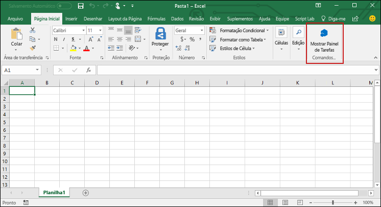

# <a name="build-an-excel-add-in-using-vue"></a>Criar um suplemento do Excel usando o Vue

Neste artigo, você passará pelo processo de criar um suplemento do Excel usando o Vue e a API JavaScript do Excel.

## <a name="prerequisites"></a>Pré-requisitos

- Instalar a [CLI do Vue](https://github.com/vuejs/vue-cli) globalmente.

    ```bash
    npm install -g vue-cli
    ```

- Instale a última versão do [Yeoman](https://github.com/yeoman/yo) e o [gerador do Yeoman para Suplementos do Office](https://github.com/OfficeDev/generator-office) globalmente.

    ```bash
    npm install -g yo generator-office
    ```

## <a name="generate-a-new-vue-app"></a>Gerar um novo aplicativo Vue

Use a CLI do Vue para gerar um novo aplicativo Vue. No terminal, execute o comando a seguir e responda aos prompts conforme descrito abaixo.

```bash
vue init webpack my-add-in
```

Ao responder aos prompts gerados pelo comando anterior, substitua as respostas padrão das três instruções a seguir. Para os demais prompts, você pode aceitar as respostas padrão.

- **Instalar o roteador vue?** `No`
- **Configurar testes de unidades:** `No`
- **Configurar testes e2e com Nightwatch?** `No`


## <a name="generate-the-manifest-file"></a>Gerar o arquivo de manifesto.

Cada suplemento requer um arquivo de manifesto para definir os recursos e configurações.

1. Navegue até a pasta do seu aplicativo.

    ```bash
    cd my-add-in
    ```

2. Use o gerador do Yeoman para gerar o arquivo de manifesto para o seu suplemento. Execute o comando a seguir e responda às solicitações conforme mostrado abaixo.

    ```bash
    yo office 
    ```

    - **Escolha um tipo de projeto:** `Manifest`
    - **Como deseja nomear seu suplemento?** `My Office Add-in`
    - **Para qual aplicativo cliente do Office você deseja suporte?:** `Excel`


    Depois de concluir o assistente, um arquivo de manifesto e um arquivo de recurso estarão disponíveis para você criar o seu projeto.

    
    
    > [!NOTE]
    > Se for solicitada a substituição de **package.json**, responda **Não** (não substituir).

## <a name="secure-the-app"></a>Proteger o aplicativo

[!include[HTTPS guidance](../includes/https-guidance.md)]

Para ativar o HTTPS para o seu aplicativo, abra **package.json** na raiz do projeto, modifique o script `dev` para adicionar o sinalizador `--https` e salve o arquivo.

```json
"dev": "webpack-dev-server --https --inline --progress --config build/webpack.dev.conf.js"
```

## <a name="update-the-app"></a>Atualizar o aplicativo

1. No editor de código, abra o arquivo de manifesto (o arquivo no diretório raiz do aplicativo com um nome que termina em "manifest.xml"). Substitua todas as ocorrências de `https://localhost:3000` por `https://localhost:8080` e salve o arquivo.

2. Abra **index.html**, adicione a marca `<script>` a seguir imediatamente antes da marca `</head>` e salve o arquivo.

    ```html
    <script src="https://appsforoffice.microsoft.com/lib/1/hosted/office.js"></script>
    ```

3. Abra **src/main.js** e *remova* o seguinte bloco de código:

    ```js
    new Vue({
        el: '#app',
        components: {App},
        template: '<App/>'
    })
    ```
    
    Depois adicione o código seguinte no mesmo local e salve o arquivo. 
                                                         
    ```js
    const Office = window.Office
    Office.initialize = () => {
      new Vue({
        el: '#app',
        components: {App},
        template: '<App/>'
      })
    }
    ```

4. Abra **src/App.vue**, substitua o conteúdo do arquivo pelo código a seguir, adicione uma quebra de linha ao final do arquivo (ou seja, após a marca `</style>`) e salve o arquivo. 

    ```html
    <template>
    <div id="app">
        <div id="content">
        <div id="content-header">
            <div class="padding">
            <h1>Welcome</h1>
            </div>
        </div>
        <div id="content-main">
            <div class="padding">
            <p>Choose the button below to set the color of the selected range to green.</p>
            <br/>
            <h3>Try it out</h3>
            <button @click="onSetColor">Set color</button>
            </div>
        </div>
        </div>
    </div>
    </template>

    <script>
    export default {
      name: 'App',
      methods: {
        onSetColor () {
          window.Excel.run(async (context) => {
            const range = context.workbook.getSelectedRange()
            range.format.fill.color = 'green'
            await context.sync()
          })
        }
      }
    }
    </script>

    <style>
    #content-header {
        background: #2a8dd4;
        color: #fff;
        position: absolute;
        top: 0;
        left: 0;
        width: 100%;
        height: 80px;
        overflow: hidden;
    }

    #content-main {
        background: #fff;
        position: fixed;
        top: 80px;
        left: 0;
        right: 0;
        bottom: 0;
        overflow: auto;
    }

    .padding {
        padding: 15px;
    }
    </style>
    ```

## <a name="start-the-dev-server"></a>Iniciar o servidor de desenvolvimento

1. No terminal, execute o comando a seguir para iniciar o servidor de desenvolvimento.

    ```bash
    npm start
    ```

2. Em um navegador da web, acesse `https://localhost:8080`. Se o navegador indicar que o certificado do site não é confiável, configure o computador para confiar no certificado. 

3. Depois que o navegador carregar a página do suplemento sem erros de certificado, será possível testar o suplemento. 

## <a name="try-it-out"></a>Experimente

1. Siga as instruções da plataforma que você usará para executar o suplemento e realizar sideload do suplemento no Excel.

    - Windows: [Realizar sideload de Suplementos do Office no Windows](../testing/create-a-network-shared-folder-catalog-for-task-pane-and-content-add-ins.md)
    - Excel Online: [Realizar sideload dos Suplementos do Office no Office Online](../testing/sideload-office-add-ins-for-testing.md#sideload-an-office-add-in-on-office-online)
    - iPad e Mac: [Realizar sideload dos Suplementos do Office no iPad e Mac](../testing/sideload-an-office-add-in-on-ipad-and-mac.md)

2. No Excel, escolha a guia **Página Inicial** e o botão **Mostrar Painel de Tarefas** na faixa de opções para abrir o painel de tarefas do suplemento.

    

3. Selecione um intervalo de células na planilha.

4. No painel de tarefas, escolha o botão **Definir cor** para definir a cor do intervalo selecionado como verde.

    

## <a name="next-steps"></a>Próximas etapas

Você criou com êxito um suplemento do Excel usando o Vue, parabéns! Agora, saiba mais sobre os recursos dos suplementos do Excel e crie um mais complexo, acompanhando o tutorial de suplemento do Excel.

> [!div class="nextstepaction"]
> [Tutorial de suplemento do Excel](../tutorials/excel-tutorial.yml)

## <a name="see-also"></a>Veja também

* [Tutorial de suplemento do Excel](../tutorials/excel-tutorial-create-table.md)
* [Principais conceitos da API JavaScript do Excel](../excel/excel-add-ins-core-concepts.md)
* [Exemplos de código do suplemento do Excel](http://dev.office.com/code-samples#?filters=excel,office%20add-ins)
* [Referência da API JavaScript do Excel](https://dev.office.com/reference/add-ins/excel/excel-add-ins-reference-overview)
