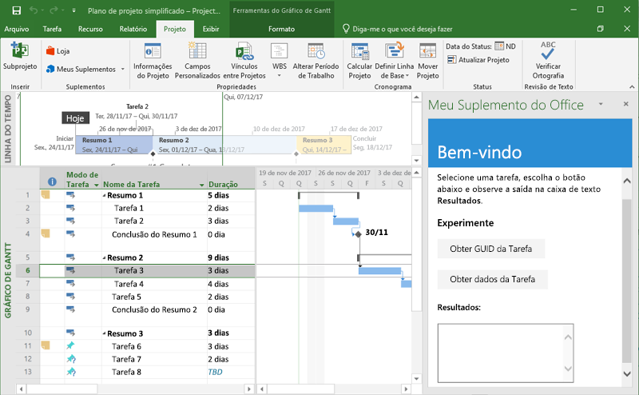
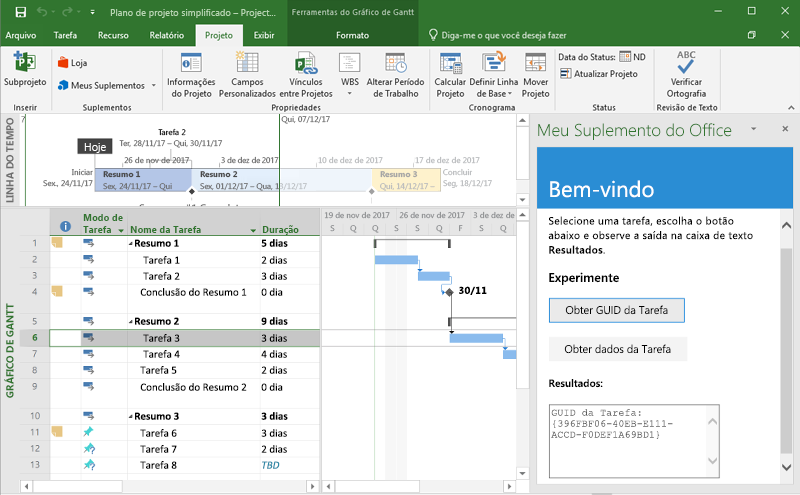
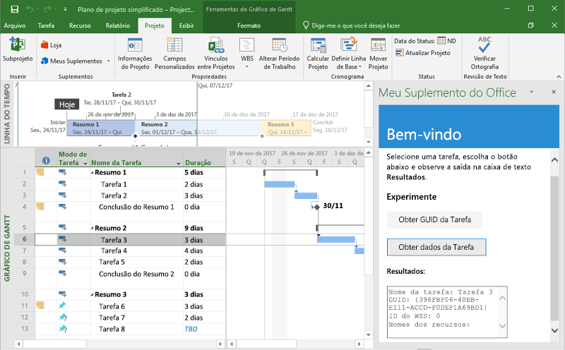

# <a name="build-your-first-project-add-in"></a><span data-ttu-id="8c251-101">Criar o primeiro suplemento do Project</span><span class="sxs-lookup"><span data-stu-id="8c251-101">Build your first Project add-in</span></span>

<span data-ttu-id="8c251-102">Neste artigo, você passará pelo processo de criar um suplemento do Project usando o jQuery e a API JavaScript para Office.</span><span class="sxs-lookup"><span data-stu-id="8c251-102">In this article, you'll walk through the process of building a Project add-in by using jQuery and the Office JavaScript API.</span></span>

## <a name="prerequisites"></a><span data-ttu-id="8c251-103">Pré-requisitos</span><span class="sxs-lookup"><span data-stu-id="8c251-103">Prerequisites</span></span>

- [<span data-ttu-id="8c251-104">Node.js</span><span class="sxs-lookup"><span data-stu-id="8c251-104">Node.js</span></span>](https://nodejs.org)

- <span data-ttu-id="8c251-105">Instale a última versão do [Yeoman](https://github.com/yeoman/yo) e o [gerador do Yeoman para Suplementos do Office](https://github.com/OfficeDev/generator-office) globalmente.</span><span class="sxs-lookup"><span data-stu-id="8c251-105">Install the latest version of [Yeoman](https://github.com/yeoman/yo) and the [Yeoman generator for Office Add-ins](https://github.com/OfficeDev/generator-office) globally.</span></span>

    ```bash
    npm install -g yo generator-office
    ```

## <a name="create-the-add-in"></a><span data-ttu-id="8c251-106">Criar o suplemento</span><span class="sxs-lookup"><span data-stu-id="8c251-106">Create the add-in</span></span>

1. <span data-ttu-id="8c251-107">Crie uma pasta na sua unidade local e nomeie-a como `my-project-addin`.</span><span class="sxs-lookup"><span data-stu-id="8c251-107">Create a folder on your local drive and name it `my-project-addin`.</span></span> <span data-ttu-id="8c251-108">Esse é o local em que você criará os arquivos para seu suplemento.</span><span class="sxs-lookup"><span data-stu-id="8c251-108">This is where you'll create the files for your add-in.</span></span>

2. <span data-ttu-id="8c251-109">Navegue até a nova pasta.</span><span class="sxs-lookup"><span data-stu-id="8c251-109">Navigate to your new folder.</span></span>

    ```bash
    cd my-project-addin
    ```

3. <span data-ttu-id="8c251-110">Use o gerador Yeoman para criar um projeto de suplemento do Project.</span><span class="sxs-lookup"><span data-stu-id="8c251-110">Use the Yeoman generator to create a Project add-in project.</span></span> <span data-ttu-id="8c251-111">Execute o comando a seguir e responda aos prompts da seguinte forma:</span><span class="sxs-lookup"><span data-stu-id="8c251-111">Run the following command and then answer the prompts as follows:</span></span>

    ```bash
    yo office
    ```

    - <span data-ttu-id="8c251-112">**Escolha um tipo de projeto:** `Office Add-in project using Jquery framework`</span><span class="sxs-lookup"><span data-stu-id="8c251-112">**Choose a project type:** `Office Add-in project using Jquery framework`</span></span>
    - <span data-ttu-id="8c251-113">**Escolha um tipo de script:** `Javascript`</span><span class="sxs-lookup"><span data-stu-id="8c251-113">**Choose a script type:** `Javascript`</span></span>
    - <span data-ttu-id="8c251-114">**Qual será o nome do suplemento?:** `My Office Add-in`</span><span class="sxs-lookup"><span data-stu-id="8c251-114">**What do you want to name your add-in?:** `My Office Add-in`</span></span>
    - <span data-ttu-id="8c251-115">**Você gostaria de proporcionar suporte para qual aplicativo cliente do Office?:** `Project`</span><span class="sxs-lookup"><span data-stu-id="8c251-115">**Which Office client application would you like to support?:** `Project`</span></span>

    
    
    <span data-ttu-id="8c251-117">Depois de concluir o assistente, o gerador criará o projeto e instalará os componentes do nó de suporte.</span><span class="sxs-lookup"><span data-stu-id="8c251-117">After you complete the wizard, the generator will create the project and install supporting Node components.</span></span>

## <a name="update-the-code"></a><span data-ttu-id="8c251-118">Atualizar o código</span><span class="sxs-lookup"><span data-stu-id="8c251-118">Update the code</span></span>

1. <span data-ttu-id="8c251-119">No editor de código, abra **index.html** na raiz do projeto.</span><span class="sxs-lookup"><span data-stu-id="8c251-119">In your code editor, open **index.html** in the root of the project.</span></span> <span data-ttu-id="8c251-120">Esse arquivo contém o HTML que será renderizado no painel de tarefas do suplemento.</span><span class="sxs-lookup"><span data-stu-id="8c251-120">This file contains the HTML that will be rendered in the add-in's task pane.</span></span>

2. <span data-ttu-id="8c251-121">Substitua o elemento `<header>` dentro do elemento `<body>` com a marcação a seguir.</span><span class="sxs-lookup"><span data-stu-id="8c251-121">Replace the `<header>` element inside the `<body>` element with the following markup.</span></span>

    ```html
    <div id="content-header">
        <div class="padding">
            <h1>Welcome</h1>
        </div>
    </div>
    ```

3. <span data-ttu-id="8c251-122">Substitua o elemento `<main>` dentro do elemento `<body>` com a marcação a seguir e salve o arquivo.</span><span class="sxs-lookup"><span data-stu-id="8c251-122">Replace the `<main>` element inside the `<body>` element with the following markup and save the file.</span></span>

    ```html
    <div id="content-main">
        <div class="padding">
            <p>Select a task and then choose the buttons below and observe the output in the <b>Results</b> textbox.</p>
            <h3>Try it out</h3>
            <button class="ms-Button" id="get-task-guid">Get Task GUID</button>
            <br/><br/>
            <button class="ms-Button" id="get-task">Get Task data</button>
            <br/>
            <h4>Results:</h4>
            <textarea id="result" rows="6" cols="25"></textarea>
        </div>
    </div>
    ```

4. <span data-ttu-id="8c251-p104">Abra o arquivo **index/src.js** para especificar o script do suplemento. Substitua todo o conteúdo pelo código a seguir e salve o arquivo.</span><span class="sxs-lookup"><span data-stu-id="8c251-p104">Open the file **app.js** to specify the script for the add-in. Replace the entire contents with the following code and save the file.</span></span>

    ```js
    'use strict';

    (function () {

        var taskGuid;

        // The initialize function must be run each time a new page is loaded
        Office.initialize = function (reason) {
            $(document).ready(function () {
                $('#get-task-guid').click(getTaskGUID);
                $('#get-task').click(getTask);
            });
        };

        function getTaskGUID() {
            Office.context.document.getSelectedTaskAsync(function (asyncResult) {
                if (asyncResult.status == Office.AsyncResultStatus.Succeeded) {
                    result.value = "Task GUID: " + asyncResult.value;
                    taskGuid = asyncResult.value;
                }
                else {
                    console.log(asyncResult.error.message);
                }
            });
        }

        function getTask() {
            if (taskGuid != undefined) {
                Office.context.document.getTaskAsync(
                    taskGuid,
                    function (asyncResult) {
                        if (asyncResult.status === Office.AsyncResultStatus.Succeeded) {
                            var taskInfo = asyncResult.value;
                            var taskOutput = "Task name: " + taskInfo.taskName +
                                            "\nGUID: " + taskGuid +
                                            "\nWSS Id: " + taskInfo.wssTaskId +
                                            "\nResource names: " + taskInfo.resourceNames;
                            result.value = taskOutput;
                        } else {
                            console.log(asyncResult.error.message);
                        }
                    }
                );
            } else {
                result.value = 'Task GUID not valid:\n' + taskGuid;
            } 
        }
    })();
    ```

4. <span data-ttu-id="8c251-125">Abra o arquivo **app.css** na raiz do projeto para especificar os estilos personalizados do suplemento.</span><span class="sxs-lookup"><span data-stu-id="8c251-125">Open the file **app.css** in the root of the project to specify the custom styles for the add-in.</span></span> <span data-ttu-id="8c251-126">Substitua todo o conteúdo pelo que está a seguir e salve o arquivo.</span><span class="sxs-lookup"><span data-stu-id="8c251-126">Replace the entire contents with the following and save the file.</span></span>

    ```css
    #content-header {
        background: #2a8dd4;
        color: #fff;
        position: absolute;
        top: 0;
        left: 0;
        width: 100%;
        height: 80px; 
        overflow: hidden;
    }

    #content-main {
        background: #fff;
        position: fixed;
        top: 80px;
        left: 0;
        right: 0;
        bottom: 0;
        overflow: auto; 
    }

    .padding {
        padding: 15px;
    }
    ```

## <a name="update-the-manifest"></a><span data-ttu-id="8c251-127">Atualizar o manifesto</span><span class="sxs-lookup"><span data-stu-id="8c251-127">Update the manifest</span></span>

1. <span data-ttu-id="8c251-128">Abra o arquivo **my-office-add-in-manifest.xml** para definir as configurações e os recursos do suplemento.</span><span class="sxs-lookup"><span data-stu-id="8c251-128">Open the file **my-office-add-in-manifest.xml** to define the add-in's settings and capabilities.</span></span>

2. <span data-ttu-id="8c251-129">O elemento `ProviderName` tem um valor de espaço reservado.</span><span class="sxs-lookup"><span data-stu-id="8c251-129">The `ProviderName` element has a placeholder value.</span></span> <span data-ttu-id="8c251-130">Substitua-o com seu nome.</span><span class="sxs-lookup"><span data-stu-id="8c251-130">Replace it with your name.</span></span>

3. <span data-ttu-id="8c251-131">O atributo `DefaultValue` do elemento `Description` tem um espaço reservado.</span><span class="sxs-lookup"><span data-stu-id="8c251-131">The `DefaultValue` attribute of the `Description` element has a placeholder.</span></span> <span data-ttu-id="8c251-132">Substitua-o com **um suplemento do painel de tarefas do Project**.</span><span class="sxs-lookup"><span data-stu-id="8c251-132">Replace it with **A task pane add-in for Project**.</span></span>

4. <span data-ttu-id="8c251-133">Salve o arquivo.</span><span class="sxs-lookup"><span data-stu-id="8c251-133">Save the file.</span></span>

    ```xml
    ...
    <ProviderName>John Doe</ProviderName>
    <DefaultLocale>en-US</DefaultLocale>
    <!-- The display name of your add-in. Used on the store and various places of the Office UI such as the add-ins dialog. -->
    <DisplayName DefaultValue="My Office Add-in" />
    <Description DefaultValue="A task pane add-in for Project"/>
    ...
    ```

## <a name="start-the-dev-server"></a><span data-ttu-id="8c251-134">Iniciar o servidor de desenvolvimento</span><span class="sxs-lookup"><span data-stu-id="8c251-134">Start the dev server</span></span>

[!include[Start server section](../includes/quickstart-yo-start-server.md)] 

## <a name="try-it-out"></a><span data-ttu-id="8c251-135">Experimente</span><span class="sxs-lookup"><span data-stu-id="8c251-135">Try it out</span></span>

1. <span data-ttu-id="8c251-136">No Project, crie um projeto simples que tenha pelo menos uma tarefa.</span><span class="sxs-lookup"><span data-stu-id="8c251-136">In Project, create a simple project that has at least one task.</span></span>

2. <span data-ttu-id="8c251-137">Siga as instruções para a plataforma que você usará para executar o suplemento e para fazer o sideload do suplemento no Project.</span><span class="sxs-lookup"><span data-stu-id="8c251-137">Follow the instructions for the platform you'll use to run your add-in to sideload the add-in within Project.</span></span>

    - <span data-ttu-id="8c251-138">Windows: [Realizar o sideload de Suplementos do Office no Windows](../testing/create-a-network-shared-folder-catalog-for-task-pane-and-content-add-ins.md)</span><span class="sxs-lookup"><span data-stu-id="8c251-138">Windows: [Sideload Office Add-ins on Windows](../testing/create-a-network-shared-folder-catalog-for-task-pane-and-content-add-ins.md)</span></span>
    - <span data-ttu-id="8c251-139">Project Online: [Realizar o sideload dos Suplementos do Office no Office Online](../testing/sideload-office-add-ins-for-testing.md#sideload-an-office-add-in-on-office-online)</span><span class="sxs-lookup"><span data-stu-id="8c251-139">Project Online: [Sideload Office Add-ins in Office Online](../testing/sideload-office-add-ins-for-testing.md#sideload-an-office-add-in-on-office-online)</span></span>
    - <span data-ttu-id="8c251-140">iPad e Mac: [Fazer sideload dos Suplementos do Office no iPad e Mac](../testing/sideload-an-office-add-in-on-ipad-and-mac.md)</span><span class="sxs-lookup"><span data-stu-id="8c251-140">iPad and Mac: [Sideload Office Add-ins on iPad and Mac](../testing/sideload-an-office-add-in-on-ipad-and-mac.md)</span></span>

3. <span data-ttu-id="8c251-141">No Project, selecione uma tarefa.</span><span class="sxs-lookup"><span data-stu-id="8c251-141">In Project, select a task.</span></span>

    

4. <span data-ttu-id="8c251-143">No painel de tarefas, escolha o botão **Obter GUID de tarefas** para gravar a GUID de tarefas na caixa de texto **Resultados**.</span><span class="sxs-lookup"><span data-stu-id="8c251-143">In the task pane, choose the **Get Task GUID** button to write the task GUID to the **Results** textbox.</span></span>

    

5. <span data-ttu-id="8c251-145">No painel de tarefas, escolha o botão **Obter dados da tarefa** para gravar várias propriedades da tarefa selecionada na caixa de texto **Resultados**.</span><span class="sxs-lookup"><span data-stu-id="8c251-145">In the task pane, choose the **Get Task data** button to write several properties of the selected task to the **Results** textbox.</span></span>

    

## <a name="next-steps"></a><span data-ttu-id="8c251-147">Próximas etapas</span><span class="sxs-lookup"><span data-stu-id="8c251-147">Next steps</span></span>

<span data-ttu-id="8c251-148">Parabéns, você criou com êxito um suplemento do Project!</span><span class="sxs-lookup"><span data-stu-id="8c251-148">Congratulations, you've successfully created a Project add-in!</span></span> <span data-ttu-id="8c251-149">Em seguida, saiba mais sobre os recursos de um suplemento do Project e explore os cenários comuns.</span><span class="sxs-lookup"><span data-stu-id="8c251-149">Next, learn more about the capabilities of a Project add-in and explore common scenarios.</span></span>

> [!div class="nextstepaction"]
> [<span data-ttu-id="8c251-150">Suplementos do Project</span><span class="sxs-lookup"><span data-stu-id="8c251-150">Project add-ins</span></span>](../project/project-add-ins.md)
