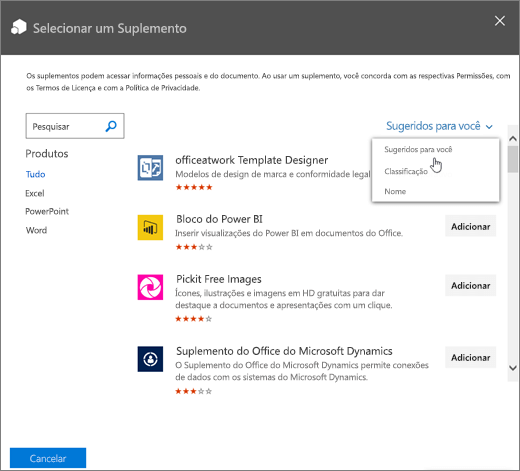
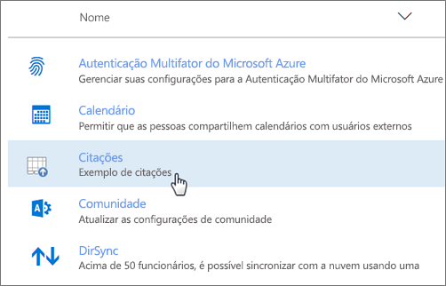
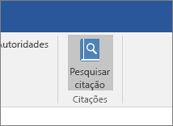

# Publicar Suplementos do Office usando a Implanta??o Centralizada por meio do Centro de administra??o do Office 365

No Centro de administra??o do Office 365, ? mais f?cil para o administrador implantar Suplementos do Office para usu?rios e grupos dentro da organiza??o. Os suplementos implantados por meio do Centro de administra??o ficam dispon?veis imediatamente para os usu?rios nos aplicativos do Office, sem a necessidade de configura??o do cliente. Voc? pode usar a Implanta??o Centralizada para implantar suplementos internos, al?m de suplementos fornecidos por ISVs.

Atualmente, o Centro de administra??o do Office 365 tem suporte para os seguintes cen?rios:

- Implanta??o Centralizada de suplementos novos e atualizados para usu?rios, grupos ou para uma organiza??o.
- Implanta??o para v?rias plataformas, inclusive Windows e Office Online; em breve para Mac.
- Implanta??o no idioma ingl?s e para locat?rios no mundo inteiro.
- Implanta??o de suplementos hospedados na nuvem.
- Implanta??o de suplementos hospedados em um firewall.
- Implanta??o de suplementos do AppSource.
- Instala??o autom?tica de um suplemento para usu?rios que iniciam o aplicativo do Office.
- Remo??o autom?tica de um suplemento para os usu?rios se o administrador desativar ou excluir o suplemento ou se os usu?rios forem removidos do Azure Active Directory ou de um grupo no qual o suplemento foi implantado.

A Implanta??o Centralizada ? a maneira recomendada para o administrador do Office 365 implantar Suplementos do Office em uma organiza??o, desde que a organiza??o atenda a todos os requisitos para usar a Implanta??o Centralizada. Confira informa??es sobre como determinar se sua organiza??o pode usar a Implanta??o Centralizada em [Determinar se a Implanta??o Centralizada de suplementos funciona para sua organiza??o do Office 365](https://support.office.com/en-us/article/Determine-if-Centralized-Deployment-of-add-ins-works-for-your-Office-365-organization-B4527D49-4073-4B43-8274-31B7A3166F92).

> [!NOTE]
> Em um ambiente local sem conex?o com o Office 365, ou para implantar Suplementos do SharePoint ou Office que visam o Office 2013, use um [Cat?logo de suplementos do SharePoint](publish-task-pane-and-content-add-ins-to-an-add-in-catalog.md). Para implantar suplementos COM ou VSTO, use o Windows Installer ou o recurso ClickOnce, como descrito em [Implantando uma solu??o do Office](https://msdn.microsoft.com/en-us/library/bb386179.aspx).

## Abordagem recomendada para implantar Suplementos do Office

Considere implantar os suplementos do Office em fases para ajudar a garantir que a implanta??o corra bem. Recomendamos o plano a seguir:

1. Implante o suplemento em um pequeno conjunto de partes interessadas de neg?cios e membros do departamento de TI. Se a implanta??o for bem-sucedida, v? para a etapa 2.

2. Implante o suplemento para um conjunto maior de pessoas que usar?o o suplemento dentro da empresa. Se a implanta??o for bem-sucedida, v? para a etapa 3.

3. Implante o suplemento para todo o conjunto de pessoas que usar?o o suplemento.

Dependendo do tamanho do p?blico-alvo, conv?m adicionar etapas a ou remover etapas deste procedimento.

## Publicar um suplemento por meio da Implanta??o Centralizada

Antes de come?ar, confirme se a sua organiza??o atende a todos os requisitos para usar a Implanta??o Centralizada, conforme descrito em [Determinar se a Implanta??o Centralizada de suplementos funciona para sua organiza??o do Office 365](https://support.office.com/en-us/article/Determine-if-Centralized-Deployment-of-add-ins-works-for-your-Office-365-organization-B4527D49-4073-4B43-8274-31B7A3166F92).

Se sua organiza??o atender aos requisitos, conclua as etapas a seguir para publicar um suplemento do Office por meio da Implanta??o Centralizada:

1. Entre no Office 365 com uma conta corporativa ou de estudante.
2. Selecione o ?cone do inicializador de aplicativos no canto superior esquerdo e escolha **Administrador**.
3. No menu de navega??o, escolha **Configura??es** > **Servi?os e suplementos**.
4. Se voc? vir uma mensagem na parte superior da p?gina anunciando o novo Centro de administra??o do Office 365, escolha a mensagem para ir para a Visualiza??o do Centro de administra??o (consulte [Sobre o Centro de administra??o do Office 365](https://support.office.com/en-ie/article/About-the-Office-365-admin-center-758befc4-0888-4009-9f14-0d147402fd23)).
5. Escolha **Carregar um Suplemento** na parte superior da p?gina. 
6. Escolha uma das op??es a seguir na p?gina **Implanta??o Centralizada**:

    - **Desejo adicionar um Suplemento do AppSource.**
    - **Tenho o arquivo de manifesto (.xml) neste dispositivo.** Para esta op??o, escolha **Navegar** para localizar o arquivo de manifesto (.xml) que voc? deseja usar.
    - **Tenho uma URL para o arquivo de manifesto.** Para esta op??o, digite a URL do manifesto no campo fornecido.

    

7.  Escolha **Avan?ar**.

8.  Se tiver selecionado a op??o para adicionar um suplemento do AppSource, escolha o suplemento. ? poss?vel exibir suplementos dispon?veis por meio das categorias **Sugeridos para voc?**, **Classifica??o** ou **Nome**. Voc? s? pode adicionar suplementos gratuitos do AppSource. Atualmente n?o ? poss?vel adicionar suplementos pagos.

    > [!NOTE]
    > Com a op??o do AppSource, as atualiza??es e os aprimoramentos do suplemento ser?o disponibilizadas automaticamente para usu?rios sem necessidade de interven??o.

    

9. O suplemento j? est? habilitado. Na p?gina para o suplemento, o status ? **Ativo**, como o mostrado para o suplemento Bloco do Power BI na captura de tela abaixo. Na se??o **Quem tem acesso**, escolha **Editar** para atribuir o suplemento para usu?rios e/ou grupos.

    

10. Na **p?gina Editar quem tem acesso**, escolha **Todos** ou **Usu?rios/grupos espec?ficos**. Use a caixa Pesquisar para encontrar usu?rios e/ou grupos para quem voc? quer implantar o suplemento.

    

    > [!NOTE]
    > Para suplementos de SSO (logon ?nico), os usu?rios e grupos atribu?dos tamb?m ser?o compartilhados com suplementos que compartilham a mesma ID de Aplicativo do Azure. Todas as altera??es nas atribui??es do usu?rio tamb?m se aplicar?o a esses suplementos. Os suplementos relacionados ser?o mostrados nessa p?gina. Apenas em suplementos de SSO, essa p?gina exibir? a lista de permiss?es do Microsoft Graph exigida pelo suplemento.

11. Depois de terminar, escolha **Salvar**, revise as configura??es do suplemento e escolha **Fechar**. Voc? ver? o suplemento juntamente com outros aplicativos no Office 365.

    > [!NOTE]
    >  Quando um administrador escolhe **Salvar**, o consentimento ? fornecido para todos os usu?rios. 

    

> [!TIP]
> Quando voc? implanta um novo suplemento para usu?rios e/ou grupos em sua organiza??o, envie um email descrevendo quando e como usar o suplemento e incluindo links para conte?do relevante da Ajuda, perguntas frequentes ou outros recursos de suporte.

## Considera??es ao conceder acesso a um suplemento

Os administradores podem atribuir um suplemento a todos na organiza??o ou a usu?rios e/ou grupos espec?ficos de dentro da organiza??o. A lista a seguir descreve as implica??es de cada op??o:

- **Todos**: Como o nome sugere, essa op??o atribui o suplemento a todos os usu?rios no locat?rio. Use essa op??o com cautela e apenas para suplementos que sejam realmente universais para sua organiza??o.

- **Usu?rios**: Se voc? atribuir um suplemento a usu?rios individuais, ser? necess?rio atualizar as configura??es da Central de implanta??o para o suplemento sempre que quiser atribu?-lo a outros usu?rios. Da mesma forma, ser? necess?rio atualizar as configura??es da Central de implanta??o para o suplemento sempre que voc? quiser remover o acesso do usu?rio ao suplemento.

- **Grupos**: Se voc? atribuir um suplemento a um grupo, os usu?rios adicionados ao grupo ser?o atribu?dos automaticamente ao suplemento. Da mesma forma, quando um usu?rio ? removido de um grupo, ele automaticamente perde o acesso ao suplemento. Em ambos os casos, nenhuma a??o adicional ? necess?ria por parte do administrador do Office 365.

Em geral, para facilitar a manuten??o, recomendamos atribuir suplementos usando grupos sempre que poss?vel. No entanto, em situa??es em que voc? deseja restringir o acesso do suplemento a um n?mero muito pequeno de usu?rios, pode ser mais pr?tico atribuir o suplemento a usu?rios espec?ficos. 

## Estados de suplementos

A tabela a seguir descreve os estados diferentes de um suplemento.

|Estado|Como o estado ocorre|Impacto|
|-----|--------------------|------|
|**Ativo**|O administrador carregou o suplemento e o atribuiu a usu?rios e/ou grupos.|Os usu?rios e/ou grupos atribu?dos ao suplemento o veem nos clientes do Office relevantes.|
|**Desativado**|O administrador desativou o suplemento.|Os usu?rios e/ou grupos atribu?dos ao suplemento j? n?o t?m acesso a ele. Se o estado do suplemento for alterado de **Desativado** para **Ativo**, os usu?rios e os grupos recuperar?o o acesso a ele.|
|**Exclu?do**|O administrador excluiu o suplemento.|Os usu?rios e/ou grupos atribu?dos ao suplemento j? n?o t?m acesso a ele.|

## Atualizar suplementos do Office que s?o publicados por meio de Implanta??o Centralizada

Depois de um suplemento do Office ter sido publicado por meio de Implanta??o Centralizada, as altera??es feitas ao aplicativo Web do suplemento automaticamente estar?o dispon?veis para todos os usu?rios assim que as altera??es forem implementadas no aplicativo Web. As altera??es feitas a um [arquivo de manifesto XML](../develop/add-in-manifests.md) de um suplemento, por exemplo, para atualizar o ?cone, texto ou comandos do suplemento, ocorrem da seguinte maneira:

- **Suplemento de linha de neg?cios**: Se um administrador tiver carregado explicitamente um arquivo de manifesto durante a implementa??o da Implanta??o Centralizada por meio do Centro de administra??o do Office 365, o administrador dever? carregar um novo arquivo de manifesto que cont?m as altera??es desejadas. Depois que o arquivo de manifesto atualizado for carregado, o suplemento ser? atualizado na pr?xima vez que os aplicativos relevantes do Office iniciarem.

- **Suplemento do AppSource**: se um administrador selecionar um suplemento do AppSource durante a implementa??o da Implanta??o Centralizada pelo Centro de administra??o do Office 365, e as atualiza??es de suplementos ocorrerem no AppSource, o suplemento ser? atualizado posteriormente pela Implanta??o Centralizada. Da pr?xima vez que os aplicativos relevantes do Office iniciarem, o suplemento ser? atualizado.

## Experi?ncia do usu?rio final com suplementos

Depois que um suplemento tiver sido publicado por meio de Implanta??o Centralizada, os usu?rios finais podem come?ar a us?-lo em qualquer plataforma que o suplemento suporte. 

Se o suplemento tiver suporte para comandos, eles ser?o exibidos na Faixa de Op??es do Office a todos os usu?rios para os quais o suplemento for implantado. No exemplo a seguir, o comando **Pesquisar Cita??o** aparece na faixa de op??es para o suplemento **Cita??es**. 

Caso contr?rio, os usu?rios podem adicion?-lo ao aplicativo do Office da seguinte maneira:

1.  Nos aplicativos Word 2016, Excel 2016 ou PowerPoint 2016, escolha **Inserir** > **Meus Suplementos**.
2.  Escolha **Administrador Gerenciado**, na janela do suplemento.
3.  Escolha o suplemento e escolha **Adicionar**. 

    
    
## Confira tamb?m
[Determine se a Implanta??o Centralizada de suplementos funciona para sua organiza??o do Office 365](https://support.office.com/en-us/article/Determine-if-Centralized-Deployment-of-add-ins-works-for-your-Office-365-organization-b4527d49-4073-4b43-8274-31b7a3166f92)
    
