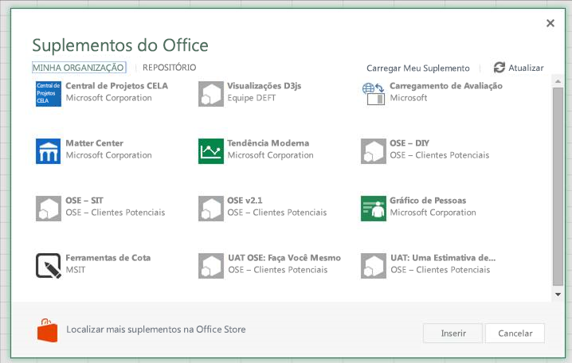
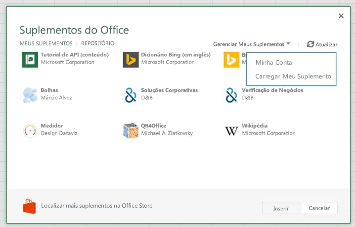

# <a name="sideload-office-add-ins-in-office-online-for-testing"></a>Realizar sideload de suplementos do Office no Office Online para teste

Você pode instalar um suplemento do Office para teste usando sideload, sem precisar primeiro colocá-lo em um catálogo de suplementos. O sideload pode ser feito no Office 365 ou no Office Online. O procedimento é ligeiramente diferente nas duas plataformas. 

Quando você realiza o sideload de um suplemento, o manifesto do suplemento é armazenado localmente do navegador e, portanto, se você limpar o cache do navegador ou alternar para um navegador diferente, precisará realizar o sideload do suplemento novamente.


> [!NOTE]
> A realização do sideload como descrito neste artigo tem suporte no Word, no Excel e no PowerPoint. Para realizar o sideload de um suplemento do Outlook, confira [Realizar sideload de suplementos do Outlook para teste](https://docs.microsoft.com/en-us/outlook/add-ins/sideload-outlook-add-ins-for-testing).

O vídeo a seguir oferece orientações para o processo de sideload do seu suplemento no Office para área de trabalho ou no Office Online.  


> [!VIDEO https://www.youtube.com/embed/XXsAw2UUiQo]

## <a name="sideload-an-office-add-in-on-office-365"></a>Realizar sideload de um suplemento do Office no Office 365


1. Entre em sua conta do Office 365.
    
2. Abra o inicializador de aplicativos à esquerda da barra de ferramentas, selecione  **Excel**, **Word** ou **PowerPoint** e crie um novo documento.
    
3. Abra a guia **Inserir** na faixa de opções e, na seção **Suplementos**, escolha **Suplementos do Office**.
    
4. Na caixa de diálogo **Suplementos do Office**, selecione a guia **MINHA ORGANIZAÇÃO** e **Carregar Meu Suplemento**.
    
    

5.  **Navegue** até o arquivo de manifesto do suplemento e selecione **Carregar**.
    
    

6. Verifique se o suplemento está instalado. Por exemplo, se for um comando do suplemento, ele deve aparecer na faixa de opções ou no menu de contexto. Se for um suplemento de painel de tarefas, o painel deve ser exibido.
    

## <a name="sideload-an-office-add-in-on-office-online"></a>Realizar sideload de um suplemento do Office no Office Online


1. Abra o [Microsoft Office Online](https://office.live.com/).
    
2. Em **Comece a usar os aplicativos online agora**, escolha **Excel**, **Word** ou **PowerPoint** e abra um novo documento.
    
3. Abra a guia **Inserir** na faixa de opções e, na seção **Suplementos**, escolha **Suplementos do Office**.
    
4. Na caixa de diálogo **Suplementos do Office**, selecione a guia **MEUS SUPLEMENTOS**, escolha **Gerenciar Meus Suplementos** e **Carregar Meu Suplemento**.
    
    

5.  **Navegue** até o arquivo de manifesto do suplemento e selecione **Carregar**.
    
    

6. Verifique se o suplemento está instalado. Por exemplo, se for um comando do suplemento, ele deve aparecer na faixa de opções ou no menu de contexto. Se for um suplemento de painel de tarefas, o painel deve ser exibido.

> [!NOTE]
>Para testar o seu suplemento do Office com o Edge, digite “**about: flags**na barra de pesquisa do Edge para exibir as opções de Configurações do Desenvolvedor.  Marque a opção “**Permitir loopback do host local**” e reinicie o Edge.

>    

## <a name="sideload-an-add-in-when-using-visual-studio"></a>Fazer sideload de um suplemento usando o Visual Studio

Se estiver usando o Visual Studio para desenvolver o suplemento, o processo de sideload é semelhante. A única diferença é que você deve atualizar o valor do elemento **SourceURL** no manifesto para incluir a URL completa em que o suplemento for implantado. 

Se estiver desenvolvendo o suplemento, localize o respectivo arquivo manifest.xml e atualize o valor do elemento **SourceLocation** para incluir um URI absoluto. O Visual Studio vai adicionar um token à implantação do localhost.

Por exemplo: 

```xml
<SourceLocation DefaultValue="https://localhost:44300/App/Home/Home.html" />
```
