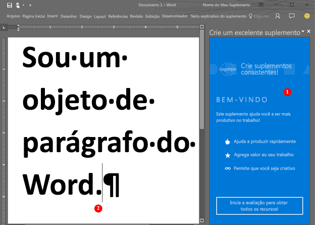

# <a name="word-add-ins-overview"></a>Vis?o geral dos suplementos do Word

Voc? deseja criar uma solu??o que estenda a funcionalidade do Word? Por exemplo, uma solu??o que envolva conjuntos de documentos automatizados? Ou uma solu??o que vincule essas associa??es aos dados e os acesse em um documento do Word a partir de outras fontes de dados? ? poss?vel usar a plataforma de suplementos do Office, que inclui a API JavaScript do Word e a API JavaScript para Office, para estender os clientes do Word que executam em uma ?rea de trabalho do Windows, em um Mac ou na nuvem.

Os suplementos do Word s?o uma das v?rias op??es de desenvolvimento dispon?veis na [plataforma de suplementos do Office](../overview/office-add-ins.md). Voc? pode usar comandos de suplemento para estender a interface do usu?rio do Word e iniciar os pain?is de tarefas que executam JavaScript que interage com o conte?do em um documento do Word. Qualquer c?digo que voc? pode executar em um navegador, pode ser executado em um suplemento do Word. Suplementos que interagem com conte?do em um documento do Word criam solicita??es para agir em objetos do Word e sincronizar o estado do objeto. 

> [!NOTE]
> Caso pretenda [publicar](../publish/publish.md) o suplemento no AppSource depois de cri?-lo, verifique se voc? est? em conformidade com as [Pol?ticas de valida??o do AppSource](https://docs.microsoft.com/en-us/office/dev/store/validation-policies). Por exemplo, para passar na valida??o, seu suplemento deve funcionar em todas as plataformas com suporte aos m?todos que voc? definir (para mais informa??es, confira a [se??o 4.12](https://docs.microsoft.com/en-us/office/dev/store/validation-policies#4-apps-and-add-ins-behave-predictably) e a [P?gina de hospedagem e disponibilidade do suplemento do Office](../overview/office-add-in-availability.md)).

A figura a seguir mostra um exemplo de um suplemento do Word que ? executado em um painel de tarefas.

*Figura 1. Suplemento em execu??o em um painel de tarefas no Word*



O suplemento do Word (1) pode enviar solicita??es para o documento do Word (2) e usar o JavaScript para acessar o objeto par?grafo e atualizar, excluir ou mover o par?grafo. Por exemplo, o c?digo a seguir mostra como acrescentar uma nova senten?a a esse par?grafo.

```js
Word.run(function (context) {
    var paragraphs = context.document.getSelection().paragraphs;
    paragraphs.load();
    return context.sync().then(function () {
        paragraphs.items[0].insertText(' New sentence in the paragraph.',
                                       Word.InsertLocation.end);
    }).then(context.sync);
});

```

? poss?vel usar qualquer tecnologia de servidor Web para hospedar o suplemento do Word, como ASP.NET, NodeJS ou Python. Use a estrutura de cliente de sua prefer?ncia (Ember, Backbone, Angular, React) ou use o VanillaJS para desenvolver a solu??o. ? poss?vel usar servi?os como o Azure para [autenticar](../develop/use-the-oauth-authorization-framework-in-an-office-add-in.md) e hospedar seu aplicativo.

As APIs JavaScript do Word proporcionam ao seu aplicativo o acesso aos objetos e metadados encontrado em um documento do Word. Voc? pode usar essas APIs para criar suplementos que t?m como objetivo:

* Word 2013 para Windows
* Word 2016 para Windows
* Word Online
* Word 2016 para Mac
* Word para iOS

Redija seu suplemento uma vez e ele ser? executado em todas as vers?es do Word em v?rias plataformas. Para obter detalhes, consulte [Disponibilidade de Suplementos do Office em hosts e plataformas](../overview/office-add-in-availability.md).

## <a name="javascript-apis-for-word"></a>APIs JavaScript para Word

Voc? pode usar dois conjuntos de APIs JavaScript para interagir com metadados e objetos em um documento do Word. O primeiro ? o [API JavaScript para Office](https://dev.office.com/reference/add-ins/javascript-api-for-office?product=word), que foi introduzido no Office 2013. Esta ? uma API compartilhada ? muitos dos objetos podem ser usados em suplementos hospedados por dois ou mais clientes do Office. Essa API usa retornos de chamadas de maneira ampla. 

O segundo ? a [API JavaScript do Word](https://dev.office.com/reference/add-ins/word/word-add-ins-reference-overview). Este ? um modelo de objeto fortemente tipado que voc? pode usar para criar suplementos do Word que se destinam ao Word 2016 para Mac e Windows. Este modelo de objeto usa promessas e fornece acesso a objetos espec?ficos do Word como [corpo](https://dev.office.com/reference/add-ins/word/body), [controles de conte?do](https://dev.office.com/reference/add-ins/word/contentcontrol), [imagens embutidas](https://dev.office.com/reference/add-ins/word/inlinepicture) e [par?grafos](https://dev.office.com/reference/add-ins/word/paragraph). A API JavaScript do Word inclui defini??es do TypeScript e arquivos vsdoc para que voc? possa obter dicas de c?digo em seu IDE.

Atualmente, todos os clientes do Word oferecem suporte ? API JavaScript para Office compartilhada, e a maioria dos clientes oferece suporte ? API JavaScript do Word. Para obter detalhes sobre clientes com suporte, consulte a [documenta??o de refer?ncia da API](https://dev.office.com/reference/add-ins/javascript-api-for-office?product=word).

Recomendamos que voc? comece com a API JavaScript do Word porque o modelo de objeto ? mais f?cil de usar. Use a API JavaScript do Word se precisar:

* Acessar os objetos em um documento do Word.

Use a API JavaScript para Office compartilhada quando precisar:

* Direcionar o Word 2013.
* Executar a??es iniciais do aplicativo.
* Verificar o conjunto requisitos com suporte.
* Acessar metadados, configura??es e informa??es do ambiente para o documento.
* Vincular a se??es em um documento e capturar eventos.
* Usar partes XML personalizadas.
* Abrir uma caixa de di?logo.

## <a name="next-steps"></a>Pr?ximas etapas

Pronto para criar seu primeiro suplemento do Word? Confira [Compilar seu primeiro suplemento do Word](word-add-ins.md). Tamb?m ? poss?vel tentar nossa [Experi?ncia de introdu??o](http://dev.office.com/getting-started/addins?product=Word) interativa. Use um [manifesto do suplemento](../develop/add-in-manifests.md) para descrever onde seu suplemento est? hospedado e como ele ? exibido, al?m de definir permiss?es e outras informa??es.

Para saber mais sobre como projetar um suplemento do Word de classe internacional que cria uma ?tima experi?ncia para seus usu?rios, consulte [Diretrizes de design](../design/add-in-design.md) e [Pr?ticas recomendadas](../concepts/add-in-development-best-practices.md).

Depois de desenvolver seu suplemento, ? poss?vel [public?-lo](../publish/publish.md) em um compartilhamento de rede, um cat?logo de aplicativos ou no AppSource.

## <a name="whats-coming-up-for-word-add-ins"></a>O que est? surgindo para os suplementos do Word?

? medida que criamos e desenvolvemos novas APIs para suplementos do Word, elas ficam dispon?veis na nossa p?gina [Especifica??es abertas da API](https://dev.office.com/reference/add-ins/openspec) para voc? deixar seus coment?rios. Descubra que novos recursos est?o no pipeline para as APIs JavaScript do Word e forne?a coment?rios sobre nossas especifica??es de design.

## <a name="see-also"></a>Veja tamb?m

* [Vis?o geral da plataforma Suplementos do Office](../overview/office-add-ins.md)
* [Refer?ncias da API JavaScript do Word](https://dev.office.com/reference/add-ins/word/word-add-ins-reference-overview)

